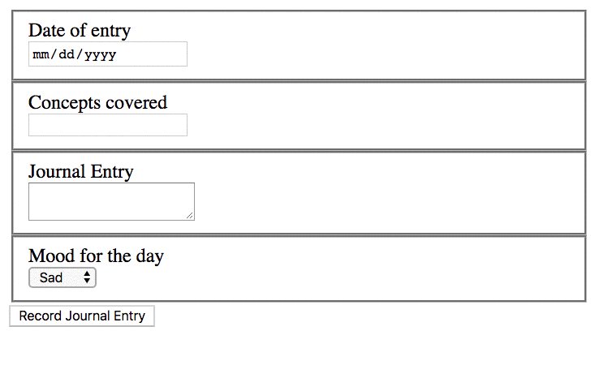

# Daily Journal

The Daily Journal application will be your opportunity to take the concepts you learn in class, and practice with the exercises and apply them elaboratively throughout the course.

## Daily Journal Design and Layout

Your first step is to build a `form` component in HTML through which you will enter your daily journal entries. It should contain the following fields.

1. Date field. Input elements in HTML can be of type `date` which will automatically render a calendar control for you to use.
1. Concepts covered. A short input field of type `text` where you enter in what concept(s) were covered and are driving the journal entry.
1. Journal entry. This is a `textarea` field where you can enter in as much text about what you learned, how you felt, and plans for the upcoming days.
1. Mood. This should be a `select` element with as many `option` child elements as you would like to describe your mood for the day. You can start with the simply happy, fine, and sad values, or pick your own scaling system.

After you have completed the form, place a `button` element beneath it labeled `Record Journal Entry`, or any other text that you would like.

## Getting Started

### Project Directory and First Files

1. Create a new sub-directory in your `workspace` directory named `daily-journal`.
1. In that directory, create an `index.html` file.
1. Create a sub-directory named `scripts`. This directory will contain all of your JavaScript files in the future.
1. Create a `styles` sub-directory and create a `main.css` file in it.

Once those are created, make sure you are in your root directory and open Visual Studio Code with the `code .` command in the terminal. Once it launches, you are ready to start coding.

### Boilerplate HTML Code

Open your `index.html`. Visual Studio Code provides many shortcuts and can write boilerplate code for you, which you then customize for your needs. Just type in the letters `html` and in the Intellisense context menu that appears, choose the "html:5" item to get some boilerplate HTML.

Inside the `<head>` tag, create a new line, type in `link` and choose the "link:css" item and change the href to `main.css`

## Building the Journal Form

You are going to use the `form` component, the `fieldset`, `label`, `input`, `textarea`, `select`, and the `option` elements to build your form.

The first step is to create a date field.

Then create an `<h1>` element above the form containing the text _Daily Journal_.

Save your file. Go to the terminal. Type in `serve`.Then go to Chrome and open your dev tools to ensure you aren't viewing a cached version of the site. Refresh the browser if you need to.

You should see this.

## Create the Remaining Fields

Now you create the rest of the fields using HTML elements. When you are done, this is how your form should look.

## Column Layout with Flexbox

Now use the `display: flex`, and `flex-direction: column` CSS properties to change your form to look like this.

## UI/UX Challenge
**This is an optional challenge once you meet MVP. Make a new GitHub branch for this challenge.**

Best Practices for Form Design
Take a look at Luke Wroblewski's article on form design, the following sections will get you started. [webforms_lukew.pdf](webforms_lukew.pdf)
1. Inputs: pp18-48 (lots of visual examples)
2. Actions: pp49-56

Refactor your Daily Journal to include best practices for form design.
