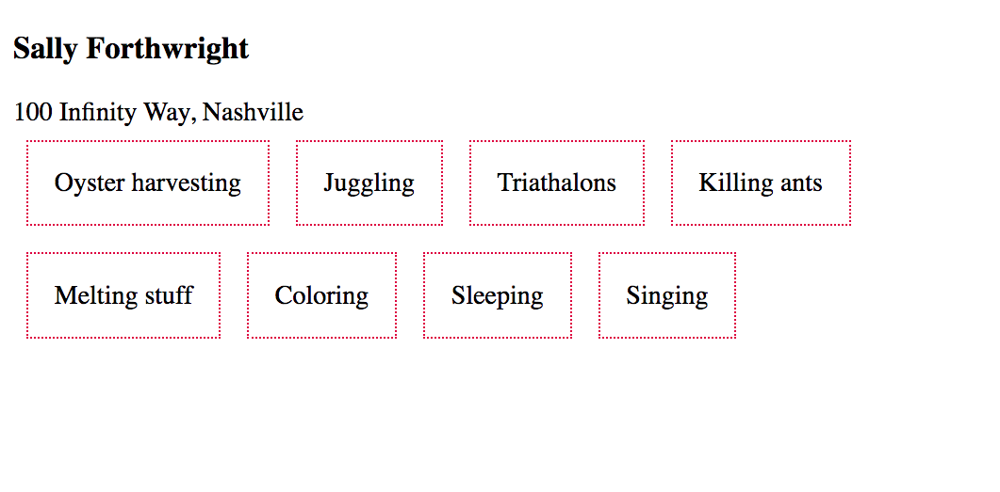
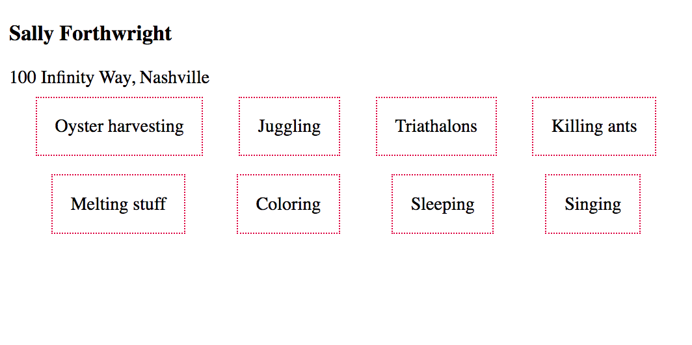
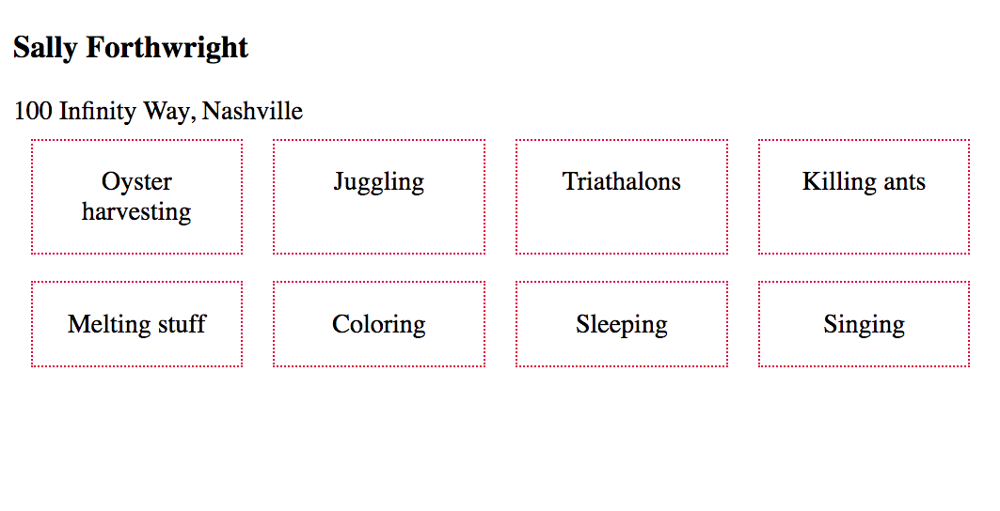

# HTML Components

## Why Are You Learning This?

Thinking of applications and web page as a collection of independent components is the foundation of modern web applications that you use all the time.

* Snapchat
* Instagram
* Twitter
* Facebook
* Etsy
* Pinterest

All of these applications are written by teams of software developers who define the individual components that are used throughout their application. They then write each component seperately and then compose them in interesting ways and make them work together.

## Visual Review of Semantic Elements

What is a component and how do HTML elements apply to the concept? Look at the image below to see an overview of semantic HTML elements and how they are intended to be used together.


## CSS Naming Conventions

Styling components intelligently can be handled through naming your classes according to the component name. One popular convention is the [BEM method](http://getbem.com/introduction/).

If you were creating an HTML component that represents you, here's an example of how the code would look using HTML semantic elements and BEM class names.

```html
<main>
    <!-- Parent biography component -->
    <article class="bio">

        <!-- Child biography component -->
        <section class="bio__name">
            <h1>Sally Forthwright</h1>
        </section>

        <!-- Child biography component -->
        <section class="bio__address">
            100 Infinity Way, Nashville
        </section>

        <!-- Child biography component -->
        <section class="bio__interests">
            <div class="interest">
                Oyster harvesting
            </div>
            <div class="interest">
                Juggling
            </div>
            <div class="interest">
                Triathalons
            </div>
        </section>

    </article>
</main>
```

Each of those components can be styled individually with a clear, concise name that also provides some semantic context when looking at the CSS file. Before you style them, all you have is structure as some very basic, default styles that the browser applies to your elements.


Now you can style any HTML component with a class of `interest` and they will all look the same.

```css
.interest {
    border: 1px dotted crimson;
    padding: 1em;
    margin: 0.5em;
}
```


## Grid Layout with Flexbox

Flexbox is a tool that you can use in CSS to take the structure of your HTML and apply interesting layouts for it. One of the most common layout type is a grid, and it's straightforward to do with Flex.

Unfortunately, these Flexbox properties are hard to remember, so you should come back to this chapter and review them whenever you need to use Flexbox to make a grid layout.

You want those three interest to be all in the same row instead of each one being an entire row all by itself. The first thing you need to do is apply a style to the component in which all of those interests are contained. In your case, it's the `<section class="bio__interests">` component.

```css
.bio__interests {
    display: flex;  /* Display the child items in a Flex layout */
}
```


The `display: flex` property on a parent component immediately creates a row and puts all of the child elements in it. However, you're not quite done.

Add some more interests for Sally.

```html
<div class="interest">
    Killing ants
</div>
<div class="interest">
    Melting stuff
</div>
<div class="interest">
    Coloring
</div>
<div class="interest">
    Sleeping
</div>
<div class="interest">
    Singing
</div>
```


The default behavior is to put **all** child components into a single row, so you eventually run out of room if there are too many. You need to tell the browser that you want it to figure out how many can fit in a row, and when there's no more room, to create a new row.

```css
.bio__interests {
    display: flex;
    flex-wrap: wrap;  /* Let the rows wrap if there are too many */
}
```



Close, but you may not like that the rows are not aligned. The browser stops at figuring out how many will fit in the row. You have to provide the instructions for how to align them.

```css
.bio__interests {
    display: flex;
    flex-wrap: wrap;
    justify-content: space-evenly; /* Evenly space the child elements */
}
```




Sooooooo close, but the boxes aren't all the same size which is distracting noise to the human brain. We find it much more pleasing when things line up evenly.

```css
.interest {
    flex-basis: 16%;  /* Make each child element the same width */
    border: 1px dotted crimson;
    padding: 1em;
    margin: 0.5em;
}
```


The final touch is to center align the text in each of the interest boxes.

```css
.interest {
    flex-basis: 16%;
    border: 1px dotted crimson;
    padding: 1em;
    margin: 0.5em;
    text-align: center; /* Center align the text in the boxes */
}
```




## Additional References

1. [CSS Tricks - BEM](https://css-tricks.com/bem-101/)
1. [Introduction to BEM - A front-end methodology](https://www.youtube.com/watch?v=IO-4Z32O--c)

## Practice: Congressional Representative

You're going to create an HTML component to represent a political candidate. Specifically, the representative of your Congressional district. Visit the GovTrack site link below, enter in your home address, and you'll find basic information about your representative.

[GovTrack - Congressional District Map](https://www.govtrack.us/congress/members/map)

1. In your HTML, create an `article` element that will serve as your main representative component. Give the element a unique identifier.
1. In this component, create a sub-component for basic information using the `section` element. In this section create elements for the representative's image, name, district info, and political affiliation.
1. Beneath the basic information, you will create a sub-component, using a `section` element, to list any committees the candidate is serving on.
1. The last component will hold links to any legislation that your representative has enacted.

Make sure you use good BEM-style class names for each element in your components. Put a comment above each component explaining what it is.

## Practice: Coffee Houses of Nashville

> The learning objective for this practice exercise is to use `display:flex` on a list component, and then add additional CSS properties to achieve a desired layout.

```html
<header class="pageHeader">Coffee Houses of Nashville</header>

<article class="list">
  <section class="shop">The Jam</section>
  <section class="shop">The Well</section>
  <section class="shop">Red Bicycle</section>
  <section class="shop">Crema</section>
  <section class="shop">Frothy Monkey</section>
  <section class="shop">8th &amp; Roast</section>
  <section class="shop">Bongo Java</section>
  <section class="shop">Flatrock</section>
  <section class="shop">Fido</section>
  <section class="shop">Steadfast Coffee</section>
  <section class="shop">Dose Coffee</section>
  <section class="shop">Sam &amp; Zoes</section>
  <section class="shop">Slow Hand Coffee</section>
  <section class="shop">The Horn</section>
</article>
```

From that HTML, use Flexbox to achieve this layout. You don't need to add the border to each coffee house component, but you can if you like. It's been added in this example to highlight the alignment and spacing you're shooting for.


## Congressional Representative UI/UX Challenge

**This is an optional challenge once you meet the requirements above. Make a new directory for this challenge.**

> UX CONCEPT: Web pages should be designed in such a way that they are easy to scan.

How to improve scannability?
* Create visual hierarchies. What is the most important information on the page? What is supportive information? Can you use bulleted lists?
* Use universally accepted conventions: These may include logo/tagline position, buttons/links, social networking options, etc.
* Break a page into clearly defined sections.
* Make it obvious what’s clickable.

Review the page you just created. Based on the items above, identify some opportunities to improve the UI/UX. Refactor your page to improve the usability. You may add semantic tags, content, and styles.

Background color - if you add a background color/image, ensure the copy (text color) has good contrast and is legible.


## Coffee Houses UI/UX Challenge
**This is an optional challenge once you meet MVP. Make a new Github branch for this challenge.**

Creating visual hierarchies.

1. Add an address, phone number, and website link to each coffee house (you may use mock/fake data)
1. You can make each coffee house component utilize Flexbox to build the layout that you want to achieve.
1. Using semantic HTML and CSS, style each coffee house component with the goals of easy scannability. At a minimum, you will emphasize the name of each shop and make the website link clearly clickable.
1. Since you are going to defining several styles for the coffee shop component, write the CSS in `shop.css` and use `@import` to include those styles in the main CSS file.

Background color - if you add a background color/image, ensure the copy (text color) has good contrast and is legible.


