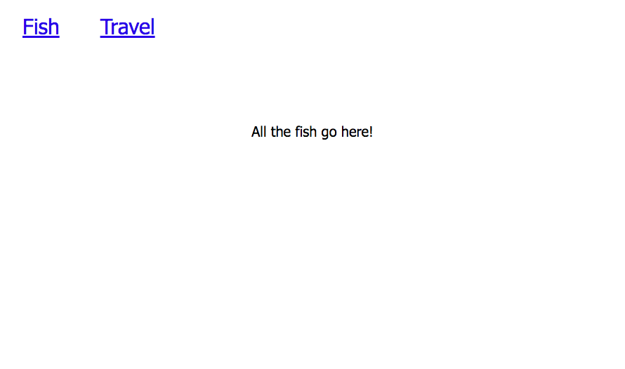
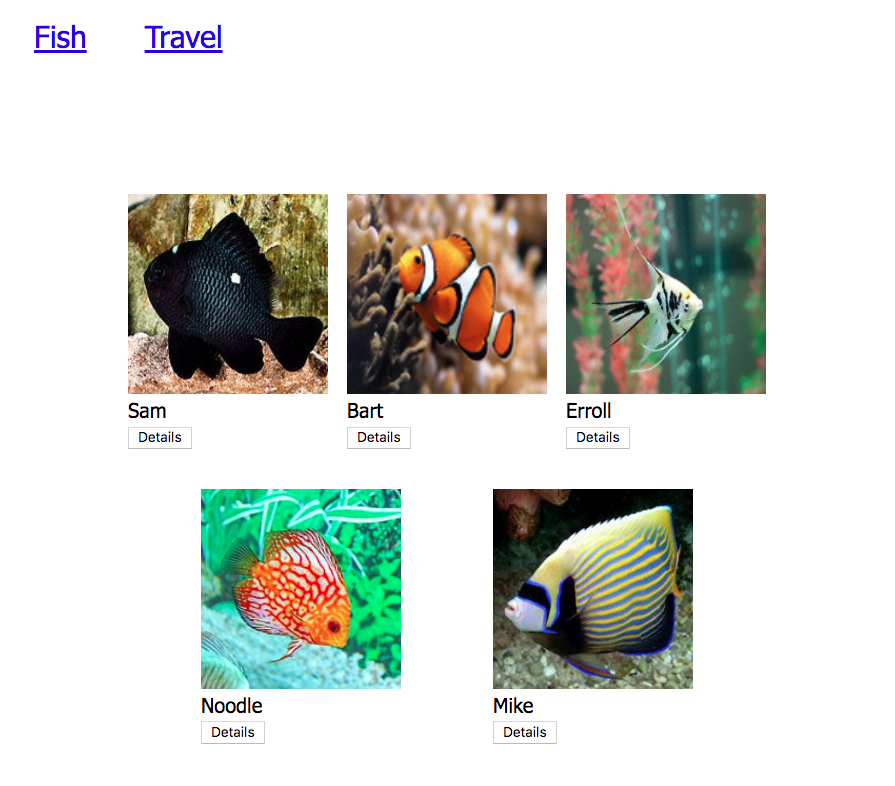
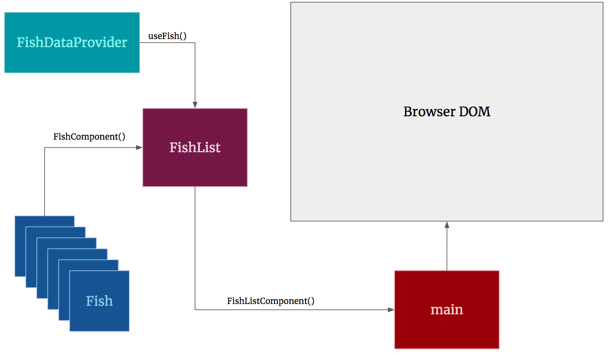

# Automate Martin's Website

Now that you have a module whose responsibility is to maintain the data and state of your application, now you need to convert that raw data into HTML representations and render them in the browser. This will automate the creation of the HTML list of fish from the objects in your fish collection, so that you never have to copy/paste the HTML directly when a fish dies, or a fish is added.

## Remove Hard-Coded HTML

Open `index.html` and delete the `<section class="fishList">` element and all of the children fish elements. Of course, as soon as you do this, all the `<dialog>` elements are now gone and your `dialogs.js` module will now throw an error as it is now trying to add an event listener to elements that no longer exist.

Refresh the browser and look in your developer console. You should see this error message.


So for the time being, you're going to comment out the code that initializes the event listeners and come back to it later.

> **`scripts/main.js`**

```js
// initializeDetailButtonEvents()
```

Now that you have removed the errors, you can move on to creating your automated fish making machine.

## Defining the Components

There are two components to this process.

1. Individual fish. This will create an HTML representation of each fish to be rendered in the list container.
1. List of fish. This will create an HTML container element and have instructions for rendering the individual fish component for each fish in the collection.

Since each of these components have a different responsibility, then each one must be created in its own module.

### Single Fish Component

> **`scripts/Fish.js`**

```js
/**
 *  FishComponent which renders individual fish objects as HTML
 */
const FishComponent = fish => {
    return `
        <div class="fish">
            <div></div>
            <div class="fish__name">${fish.name}</div>
            <button id="button--bart">Details</button>

            <dialog class="dialog--fish" id="details--bart">
                <div>Species: ${fish.species}</div>
                <div>Location: ${fish.location}</div>
                <div>Length: ${fish.size}</div>
                <div>Food: ${fish.food.join(",")}</div>

                <button class="button--close" id="close-bart">Close Dialog</button>
            </dialog>
        </div>
    `
}

export default FishComponent
```


### Fish List Component

> **`scripts/FishList.js`**

```js
/**
 *  FishListComponent which renders individual fish objects as HTML
 */
import { useFish } from "./FishDataProvider.js"

const FishListComponent = () => {

    const contentElement = document.querySelector(".content")
    const fishes = useFish()

    contentElement.innerHTML += `
        <section class="fishList">
            All the fish go here!
        </section>
    `
}

export default FishListComponent
```

## Rendering the List in Main Module

Since we want the fish to be immediately rendered when the page loads, then that falls within the responsibility of the `main.js` module. Import the list component into main and invoke the component function.

```js
import initializeDetailButtonEvents from './dialogs.js'
import FishListComponent from './FishLilst.js'

// initializeDetailButtonEvents()
FishListComponent()
```

Refresh your browser again and you should see the following message in the middle of the screen.



Hooray!! Your fish list component got rendered to the browser. Next is to render all the fish.

You need the `FishComponent` component function to do that. That function is in the `Fish.js` module, so you need to import it from there.

```js
import FishComponent from "./Fish.js"
```

Now you can write a `for..of` loop to generate all of the individual fish HTML representations, and keep appending the HTML to a variable. After the loop is done, you have one, long string containing all the HTML.

```js
/**
 *   FishListComponent which renders individual fish objects as HTML
 */
import { useFish } from "./FishDataProvider.js"
import FishComponent from "./Fish.js"

const FishListComponent = () => {

    const contentElement = document.querySelector(".content")
    const fishes = useFish()

    // Generate all of the HTML for all of the fish
    let fishHTMLRepresentations = ""
    for (const fish of fishes) {
        fishHTMLRepresentations += FishComponent(fish)
    }

    // Add a section, and all of the fish to the DOM
    contentElement.innerHTML += `
        <section class="fishList">
            ${fishHTMLRepresentations}
        </section>
    `
}

export default FishListComponent
```

Now refresh your browser again and all of your fish should be back.



## Ok, So, What Just Happened

You may have understood each step as you did, or you may not have.

You may have understood how all the pieces connect, or you may not have.

With our years of experience introducing beginners to these abstract concepts, we know that somewhere between 90% to 100% of your entire cohort simply is not capable of understanding the big picture here. You can make sense of each tree, but you can't understand how the forest works as a single ecosystem that is made up of individual trees.

There are several abstract concepts at play here, and your brain's neural network has not been tuned to understand these complex connections yet. That doesn't mean your mind **can't** do it.

It just can't do it yet.

We have also learned that some people like a visualization of how all the pieces work together, so here's one that shows all the components, and what each module exports for use in other modules.



## Practice: Argumentative

Understanding how arguments and parameters work with functions - especially when the functions are defined in a different module that where they are used - is something that is hard to understand. In this practice exercise, you are going to explore this concept.

First, in the following line of code in the **`FishList`** module...

```js
fishHTMLRepresentations += FishComponent(fish)
```

Remove the fish argument that is being passed to the **`FishComponent`** component function.

```js
fishHTMLRepresentations += FishComponent()
```

Refresh your browser. Make sure your developer console is open and you will see the following exception.


The exception tells you exactly where it occurred. Line 8 of the `Fish.js` module (_**Note:** your line number may be different if you have comments or different amounts of whitespace_). If you open that module and go the the line specified, you will see this.

```js
src="${fish.image}"
```

The key term is `'image' of undefined`. Whenever you see an exception like that, look to the left of the property being accessed. In this case, look to the left of `'image'`. You will see the variable `fish`. That's undefined.

Why is it undefined? It's because you removed the argument that you were passing in when you invoked the function. This component function defines a parameter.

```js
const FishComponent = (fish) => {
```

Since you invoked this function without a corresponding argument...

```js
fishHTMLRepresentations += FishComponent()
```

Then the parameter never gets assigned a value to reference. Therefore, it's undefined, and you can't access an `.image` property of something that is undefined.

Now put the argument back in when you invoke the component function and it should all work again.
