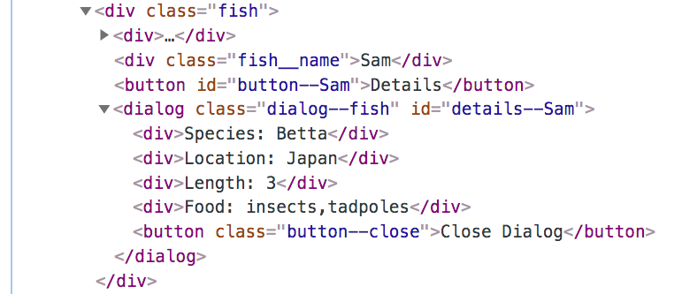

# Dynamic Event Listeners

Now that you have automated the generation of the HTML representations of fish, it's time to get the buttons working again.

Open your `main.js` module and bring back the initialization function that you imported from `dialog.js`.

```js
// initializeDetailButtonEvents()
FishListComponent()
```

Change the order and uncomment the function.

```js
FishListComponent()
initializeDetailButtonEvents()
```

Refresh your browser and look in your developer console. You still get the following exception.


Which seems strange because all of the fish components are rendered to the DOM before you initialize the listeners. Why does the following code fail?

```js
document.querySelector("#button--sam")
```

If you inspect your actual DOM, you will notice that since you now are using `${fish.name}` in the **`FishComponent`** component function to build the HTML...

```js
<button id="button--${fish.name}">Details</button>
```

The `id` no longer has `sam` in it. It now has `Sam` in it. That capital S makes it fail.




## Getting the Name Right

You could just modify every event listener, manually, to match the uppercased name of each fish, but then you are back to doing manual work over, and over again if new fish are added or existing ones are removed. You need to write code that automatically handles the user clicking on **ANY** of the detail buttons.

