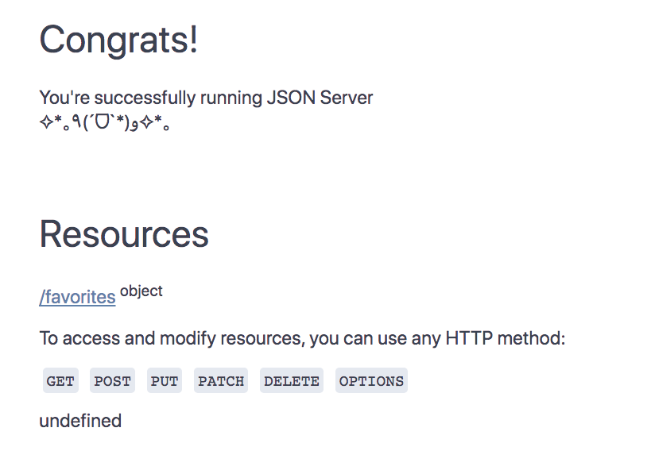

# Favorite Photos

For this exercise, you need to have your own `json-server` running and then you will be using `fetch` with the POST method to create new entries in your database for favorite photos.

## Setup

1. Create an `api` sub-directory in your application directory.
1. Create an `api/db.json` file.
1. Open that file in Visual Studio Code and place the following code in it.
    ```json
    {
        "favorites": []
    }
    ```
1. Then in your terminal, `cd api` and run the following command.
    ```sh
    json-server -w db.json -p 5050
    ```
1. Visit http://localhost:5050 in your browser and you should see a response from `json-server` with a single resource of "favorites" with zero items in it.



## Favorites Button

Add a button labeled "Favorite" under the image that gets rendered for the Astronomy Picture of the Day. When the user clicks the favorite button, you need to post a new object to the favorites collection in your API. The object should contain information about what is being favorited.

* Which API you used to get the photo
* The date of the photo

```js
{
    "source": "APOD",
    "date": "2019-10-03"
}
```

You need to stringify that object when you write your `fetch` method with the POST verb. Write a function in your **`FavoritesProvider`** component that saves a favorite. Perhaps name it `saveFavorite()`? Below is example code to put in that function.

> #### `glassdale/scripts/favorites/FavoritesProvider.js`

```js
return fetch("http://localhost:5050/favorites", {
    method: "POST",
    headers: {
        "Content-Type": "application/json"
    },
    body: JSON.stringify(your_object_here)
})
    .then(getFavorites)
```

Once you save that favorite item, the state of the API has changed. That means that you need to update the state of your application to match the state of the API.

> #### `glassdale/scripts/favorites/FavoritesList.js`

```js
favoriteButton.addEventListener("click", event => {
    // Construct `favorite_object` here

    // Save new favorite
    saveFavorite(favorite_object)
        .then(
            () => {
                // Get the favorites
                const updatedFavorites = useFavorites()

                // Now that you have an array of favorites, render them
            }
        )
})
```
