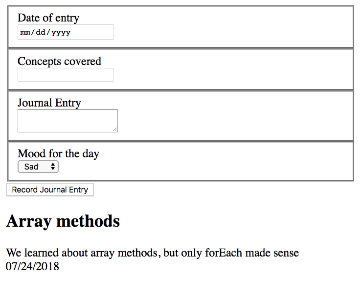

# Daily Journal

You have built your form for entering in journal entries, so now you need to define how the data that you will be collecting in the form should be stored. Your learning objective for this chapter is to build a function that returns an HTML representation of a journal entry data structure, and render it to the DOM.

## The First Journal Entry Rendered to the DOM

By the end of this chapter - once you have all the functionality written - you will see your journal entry beneath your form.




## Journal Entries in the DOM

In this chapter you will take your raw data structures, and create HTML representations of them so they can be added to the DOM. You can't add JavaScript objects to the DOM. Only HTML can be rendered by the browser.

### Journal Entry Component

Add a two, new JavaScript modules to your application named `JournalEntryList.js` which will be responsible for rendering a list of entry components, and `JournalEntry.js` which will be responsible for rendering a single journal entry.

You've worked on exercises in which you wrote functions that returned HTML components. Now write a function that builds a journal entry HTML string template.

> src/scripts/journal.js

```js
const journalEntries = [
    {
        concept: "Array methods",
        date: "07/24/2018",
        entry: "We learned about array methods, but only forEach made sense",
        mood: "Ok"
    }
]

/*
    Purpose: To create, and return, a string template that
    represents a single journal entry object as HTML

    Arguments: journalEntry (object)
*/
const makeJournalEntryComponent = (journalEntry) {
    // Create your own HTML structure for a journal entry
    return `

    `
}
```

## Render Journal Entries to the DOM

Create a new element in your `index.html` file that will be the container for all of your journal entries. Place it beneath the form component.

> src/index.html

```html
<article class="entryLog">

</article>
```

Now write a function whose reponsibility is to iterate your array of journal entries and add them to the DOM.

> src/scripts/journal.js

```js
/*
    Purpose: To render all journal entries to the DOM

    Arguments: entries (array of objects)
*/
const renderJournalEntries = (entries) => {

}

// Invoke the render function
renderJournalEntries(journalEntries)
```

