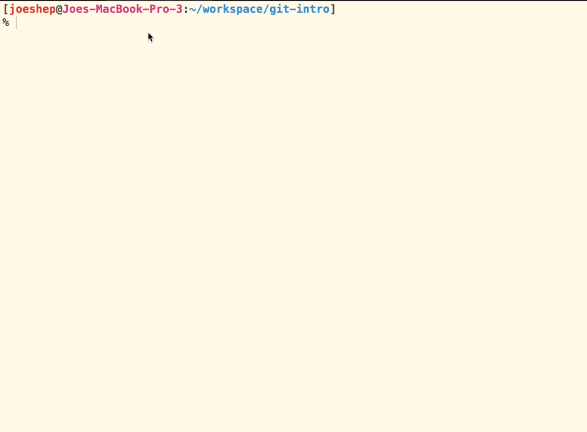
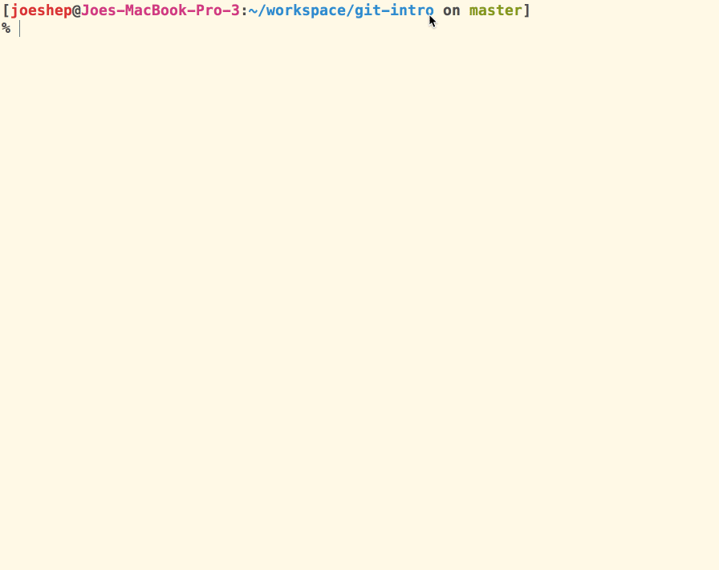
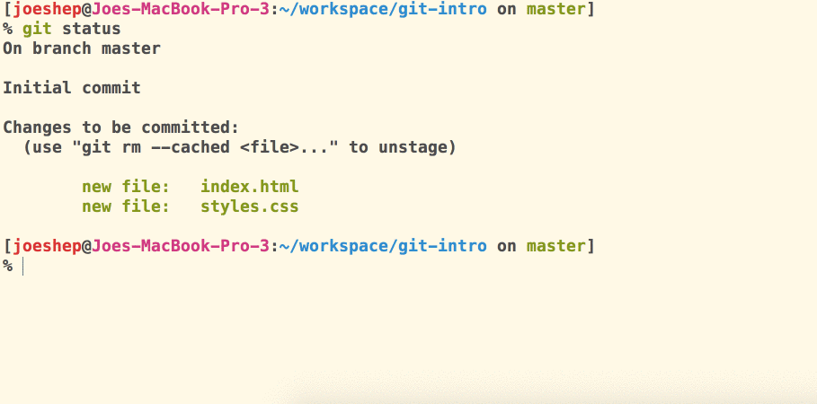
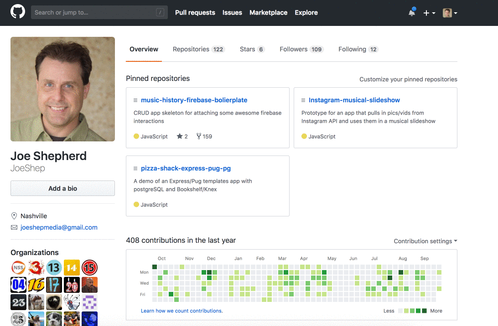
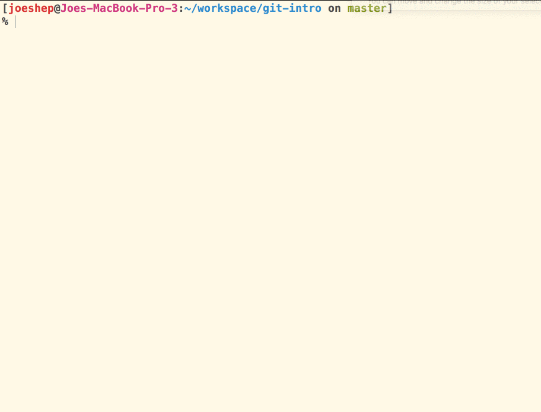
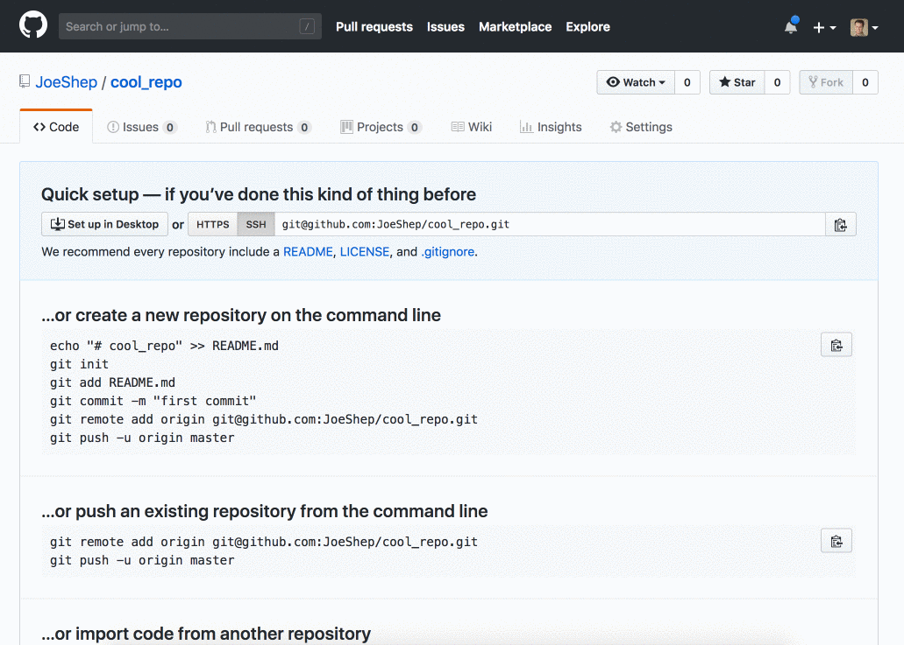

# Git

A distributed version control system for keeping a history of your code.

## Creating a Git Repository for an Application

1. Create a directory to store your application's code.
    ```sh
    cd
    mkdir -p workspace/git-intro
    ```
1. `cd` to that directory
1. Type in the `git init` command
1. You now have a git repository

The magic is the `.git` directory that gets create when the `git init` command is executed. To see this directory you can use `ls -la`, which shows hidden files and directories. Operating systems will not show files and directories that begin with a period by default. They are considered hidden, or system assets.

## Making Your First Commit

1. Create an HTML file with `touch index.html`
1. Create a CSS file with `styles.css`

Since git tracks all changes - unless you tell it to ignore some files, which we will cover later - your two new files will be recognized as new, untracked files by git.

Type `git status` to see the status of all files in your new repository.



Next, Tell git that you want to start tracking those files with `git add .` command. The period means "add all untracked files from this directory, and any sub-directories". But be careful! Using the `add .` command means you're adding all untracked files. It's a good habit, at least for the time being, to type `git status` after using this command to make sure you're not adding something you didn't expect.

So, go ahead and type `git status` again and git will have a new messages that those two files are ready to be committed.



Next, you need to commit your changes. Every time you make a commit, git will keep track of how the code looked at that moment in time, in case you ever need to go back to a previous version. You commit your changes with the following command.

```sh
git commit -m "A descriptive message about what changes you made in this commit"
```

 > _Newb hint!_ If you accidentally type `git commit` and hit enter without the `-m` and the message, you'll be taken to a screen that will make you feel like Alice through the looking glass. If this happens, for now just come see an instructor and we'll get you back to reality safely.

 Once you make your commit, do a `git status` one more time, and git will tell you that there's nothing left to commit.




+ `git log` to see all of your commits for this repo. `q` to quit git log (if log is long enough)

# Backing Up and Sharing Code on Github

Github is a _software as a service_ (SASS) that allows you to back up your repository to the cloud and share it with other software developers. Note that it is not the same thing as git, which is an application you are running locally on your machine. Github and git are made to talk to each other, but they are separate entities.

## Pushing to Github

When you are ready to share your code with your teammates, or the general public, you can push your repository to Github. Think of Github as an external drive you plug into your laptop to use as backup. Instead of it backing up the entire hard drive, you will back things up, one project at a time, only when you want to.

### Create Github Repository

The first thing you need to do is create a new repository on Github's platform that you will use to backup the code on your laptop. Once the repository is created, you will need to copy the connection string for it.

1. You are free to name your repository anything you like, within certain restrictions. For clarity you might name it the same thing as your local application folder, but there is no 'official' requirement to do so. ( _The animated example below is setting up a project to be deployed on the web, so it uses the specific naming convention of `foo.github.io`. you don't need to worry about that for now_ )
1. Click the button to create the repository.
1. Copy the connection string to your clipboard.



### Add the Connection String Locally

Now you tell your local repository where you would like it to send the code when you're ready to back it up.

```sh
git remote add origin paste-connection-string-here
```

Now it's time to do the backup. You use the `git push origin master` command to do that.

```sh
git push origin master
```



Now that the code has successfully been backed up, go back to your browser, and refresh the page. You will see that your remote repository backup now has your two files in it.




## Additional Reading

+ [git - the simple guide](http://rogerdudler.github.io/git-guide/)
