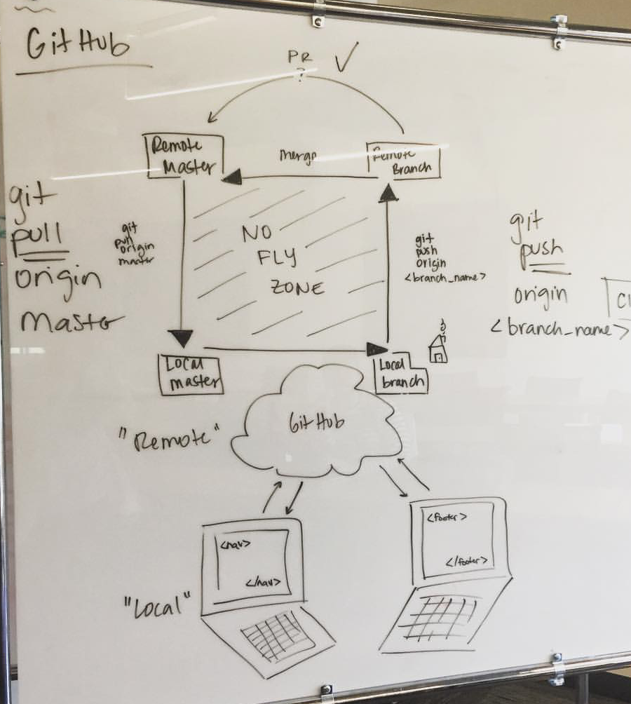
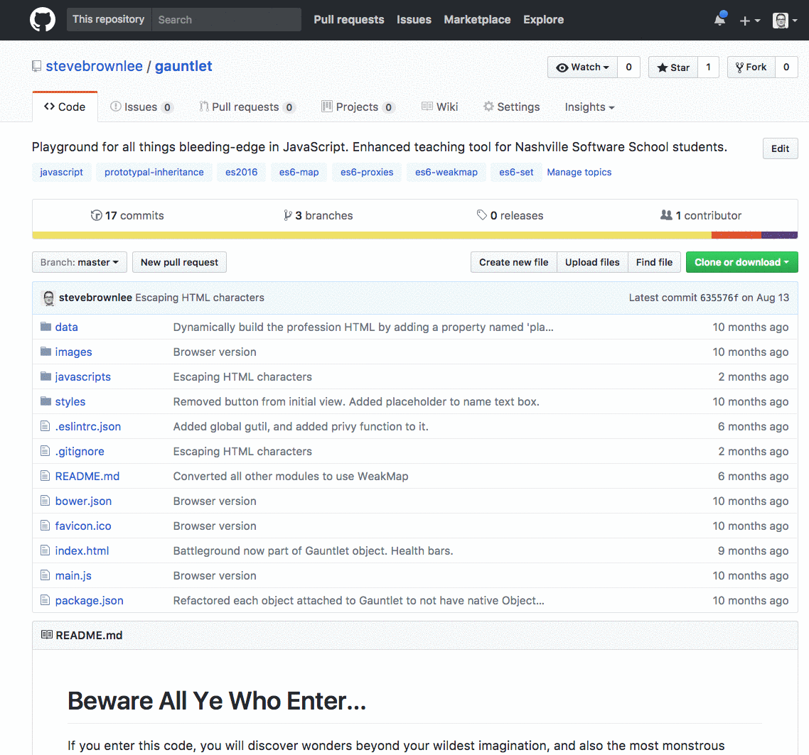

# The Github Workflow for Team Development



## Rule Number 1

Always create a `.gitignore` file before you start any work on any feature.

## Rule Number 2

Always work on a feature branch `git checkout -b newBranchName`

## Workflow Overview

While you are working on a feature, you commit to a branch, never to master. Once you are certain that your work is complete, you need to submit your work to the team to be approved. Having at least one more person look at your code before it is merged into the master branch achieves several goals.

1. Catch common syntax errors.
1. Provides a different perspective that can strengthen the code if enhancements are suggested.
1. Allows other teammates to have a greater knowledge of system.

Github enables you to share your code with your teammates for approval, and get it merged into the master branch.

## Push your Work

Push your branch to Github.

```sh
git push origin newBranchName
```

## Create a Pull Request

To create a pull request, follow these steps.

1. Click the _Pull Requests_ tab on your Github project.
1. Click the _New Pull Request_ button.
1. Select your branch to compare to master.
1. Provide an explanation for your pull request.
1. Provide steps that your teammate can use to test it.
1. Submit Pull Request.



## Review and Approval

You teammate will review your code, provide comments or suggestions if necessary. Once you and your teammate are happy with the code, you will receive a thumbs up.

If you are review another teammate's code, you will pull down their branch.

```sh
git fetch --all
git checkout theirBranch
```

Then follow the steps that they provided to test the code.

## Merging

After your pull request is approved, you can open it on Github and click the merge button.


