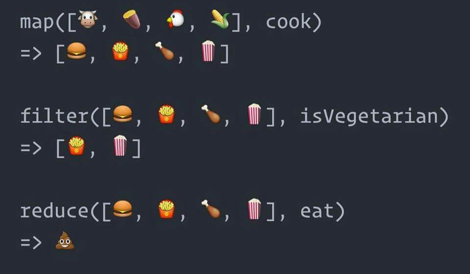

# Shaping Data with Array Methods

## forEach

This is a straight up replacement for a `for` loop. However, where a `for` loop simply iterates _n_ number of times, the `forEach()` method is an operation on an array.

```js
/*
    A `for` loop is not an operation on an array at all,
    even if we use an array's length to determine how many
    times the loop will iterate.
*/
const animals = ["cow", "chicken", "pig", "fish"]

// This `for` loop iterates 4 times
for (let i = 0; i < animals.length; i++) {

    // The logic inside the for block has NOTHING to do with
    // the animals array at all.
    console.log(`This is iteration ${i}`)

}
```

```js
const animals = ["cow", "chicken", "pig", "fish"]

/*
    A function whose purpose is to cook an animal and
    return the processed result
*/
const cookIt = function (animal) {
    switch (animal) {
        case "cow":
            console.log("steak");
            break;
        case "chicken":
            console.log("drumstick");
            break;
        case "pig":
            console.log("bacon");
            break;
        case "fish":
            console.log("sushi");
            break;
    }
}

// Execute the cookIt function for each item in the array
animals.forEach(cookIt)
```

## map

The `map()` method will also iterate over each item in an array and run the logic of the specific function each time. The difference is that running `map()` creates a new function. You never want to modify your raw data in your database, so when you need to transform it, you need a **new** array so your source remains unchanged.

```js
const rawIngredients = ["cow", "potato", "chicken", "corn"]

/*
    You will often see the processing function for these
    methods defined anonymously, rather than defined
    separately as it was in the previous example.
*/
const cookedIngredients = rawIngredients.map(function (ingredient) {
    switch (ingredient) {
        case "cow":
            return "hamburger"
            break
        case "potato":
            return "fries"
            break
        case "chicken":
            return "drumstick"
            break
        case "corn":
            return "popcorn"
            break
    }
})

console.log(cookedIngredients)
> ​​​​​[ 'hamburger', 'fries', 'drumstick', 'popcorn' ]​​​​​

console.log(rawIngredients)
> ['cow', 'potato', 'chicken', 'corn'] // Source data unchanged
```

## filter

The `filter()` method is when you want to weed out some of the source data that doesn't meet the criteria for a solution.

```js
const rawIngredients = [
    { "name": "cow", "type": "meat" },
    { "name": "potato", "type": "vegetable" },
    { "name": "chicken", "type": "meat" },
    { "name": "corn", "type": "vegetable" }
]

/*
    You can also use the new ES6+ function declaration
    syntax for your anonymous function.
*/
const vegetarianIngredients = rawIngredients.filter(ingredient => {
    const isVegetarian = (ingredient.type === "vegetable")
    return isVegetarian
})

console.log(vegetarianIngredients)
> ​​​​​[ { name: 'potato', type: 'vegetable' },​​​​​
  ​​​​​  { name: 'corn', type: 'vegetable' } ]​​​​​

console.log(rawIngredients)
> [ { 'name': 'cow', 'type': 'meat' },
    { 'name': 'potato', 'type': 'vegetable' },
    { 'name': 'chicken', 'type': 'meat' },
    { 'name': 'corn', 'type': 'vegetable' }
] // Source data unchanged
```


## reduce

## Confused? This may help. 


## Videos to Watch

## Practice
