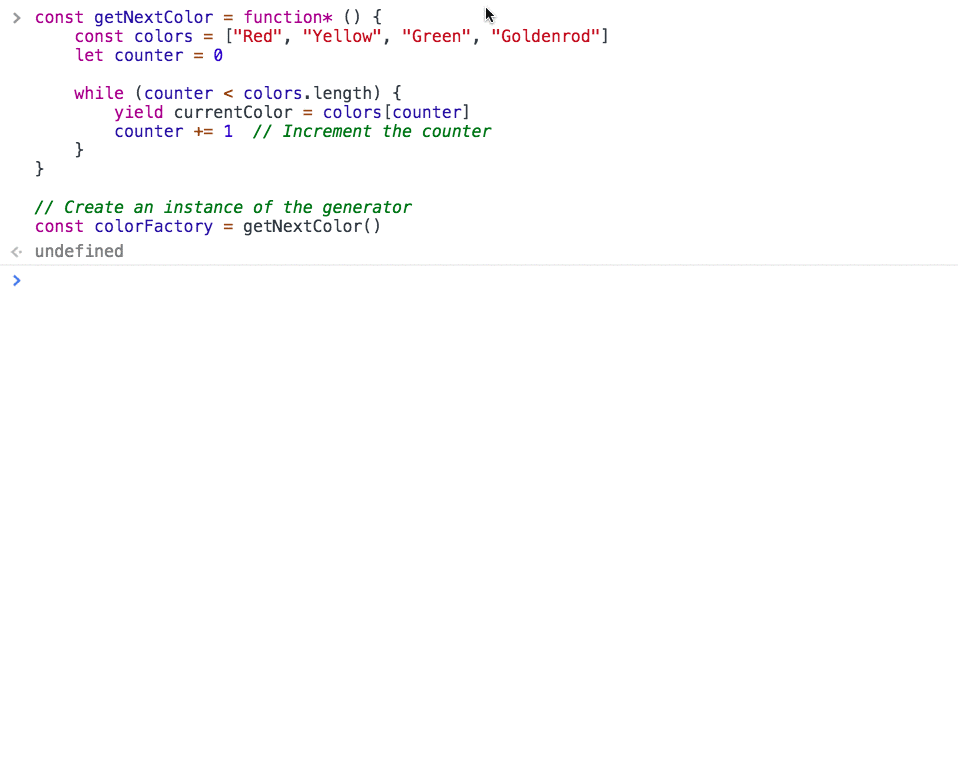
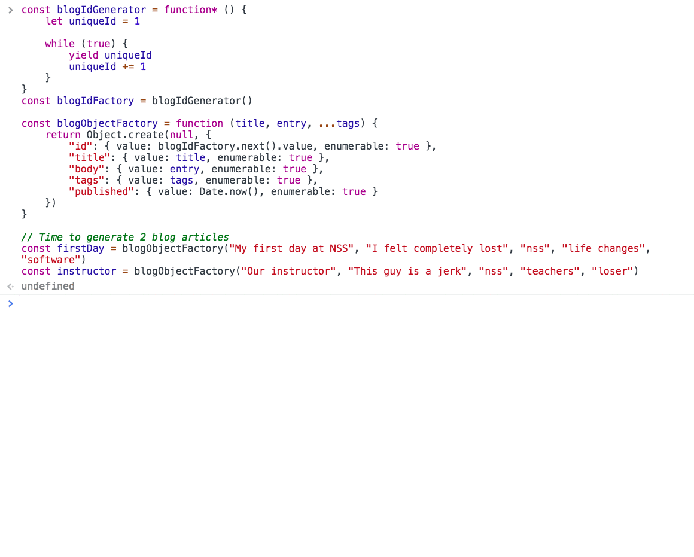

# Factory & Generator Functions

## Factory Function

Ref: [What Are Factory Functions in JavaScript](https://www.sitepoint.com/factory-functions-javascript/)

First, a factory function is just a regular function. No syntactical difference. We've coined certain functions as factory functions simply because they return new objects.

```js
// Not a factory function. Primitive type returned.
const add = function (first, second) {
    return first + second
}
```

```js
// This is a factory function. It returns a new object every time.
const generateTrashCan = function (volume = 10) {
    return Object.create(null, {
        "type": {
            enumerable: true,
            value: "Trash Can"
        },
        "volume": {
            enumerable: true,
            value: volume
        },
        "color": {
            enumerable: true,
            value: "Black"
        }
    })
}
```

## Generator Functions

Ref: [MDN Generator Functions](https://developer.mozilla.org/en-US/docs/Web/JavaScript/Reference/Global_Objects/Generator)

A generator function does have a specific syntax. You put an asterisk after the `function` keyword. You use generator functions when you need to retrieve the next item in a series of values at any time. It maintains its state across each execution, where non-generator functions do not.

The following function will return `Red` every time because once it executes, the memory used is released and all variables are eradicated.

```js
// Non-generator function
const getNextColor = function () {
    const colors = ["Red", "Yellow", "Green", "Goldenrod"]
    let counter = 0

    const currentColor = colors[counter] // Red
    counter += 1  // Increment the counter
    return currentColor
}

console.log(getNextColor())  // Red
console.log(getNextColor())  // Red
```

Conversely, the variables in a generator function do not get released between executions.

```js
const getNextColor = function* () {
    const colors = ["Red", "Yellow", "Green", "Goldenrod"]
    let counter = 0

    while (counter < colors.length) {
        yield currentColor = colors[counter]
        counter += 1  // Increment the counter
    }
}

// Create an instance of the generator
const colorFactory = getNextColor()

// Get the first generated item in the collection
colorFactory.next().value  // Red

// Get the next generated item in the collection
colorFactory.next().value  // Yellow
```



## Combining Generator and Factory Functions

A good, practical use case for these types of objects is for when you need to create a new object, on demand, that has a unique identifier. Let's look at an example.

```js
// A generator that never ends!
const blogIdGenerator = function* () {
    let uniqueId = 1

    while (true) {
        yield uniqueId
        uniqueId += 1
    }
}

// Create instance of generator
const blogIdFactory = blogIdGenerator()

// Factory function that returns a blog article object
const blogObjectFactory = function (title, entry, ...tags) {
    return Object.create(null, {
        "id": { value: blogIdFactory.next().value, enumerable: true },
        "title": { value: title, enumerable: true },
        "body": { value: entry, enumerable: true },
        "tags": { value: tags, enumerable: true },
        "published": { value: Date.now(), enumerable: true }
    })
}

// Create a blog article about your first day at NSS
const firstDay = blogObjectFactory("My first day at NSS", "I felt completely lost", "nss", "life changes", "software")

// Create a blog article about your instructor
const instructor = blogObjectFactory("Our instructor", "This guy is a jerk", "nss", "teachers", "loser")
```



## Videos to Watch

1. [Javascript Generators](https://www.youtube.com/watch?v=QO07THdLWQo)
1. [JavaScript ES6 - Iterators and Generators](https://www.youtube.com/watch?v=lbBZXw2hKH4)

## Practice - Colored Reindeer

In this exercise, you start with a collection of reindeer names. Your task is to add each reindeer name to an HTML `article` element with an `id` of `colored-reindeer`.

 After you read the instructions, your goal is to have three functions.

1. A generator function to yield colors.
1. A factory function to build a new reindeer object. This function will need to use the generator.
1. The main builder function (see below) which will call the factory function and then place each object in an array.

To start you off, paste in the following code into your JavaScript file.

```js
const coloredReindeerBuilder = function () {
    const reindeer = ["Dasher", "Dancer", "Prancer", "Vixen", "Comet", "Cupid", "Donner", "Blitzen"]

    // Write a for loop that looks at each reindeer
        // Invoke factory function to create reindeer object

        // Put new reindeer object in coloredReindeer array


    // Return coloredReindeer array
}
```

Your job is to...

1. Create a new object that represents a reindeer - the object will include the reindeer's name and its color. Use a generator function to attach each of the following colors, in order, to the reindeer. Use a factory function to generate the reindeer object.

    ```js
    ["Blue", "Red", "Orange", "Purple", "Goldenrod", "Aquamarine", "Olive", "Azure", "Fuchsia", "Chocolate", "Salmon", "Amaranth"]
    ```
1. Place each object in an array named `coloredReindeer`.

    ```js
    // Each object produced by the factory function
    [{ "name": "Dasher", "color": "Blue" }, etc...]
    ```
1. Iterate over the `coloredReindeer` array and insert a new `<section>` element in the `colored-reindeer` element that displays the reindeer name, with a font color corresponding to the color in the object.

    ```html
    <!-- Example of what your HTML should look like -->
    <article id="colored-reindeer">
        <section style="color: Blue">Dasher</section>
        <section style="color: Red">Dancer</section>
        etc...
    </article>
    ```

> **Pro tip:** Remember to make your code modular. The JavaScript for generating the data should be in one file, and the JavaScript for manipulating the DOM should be in a different file.
