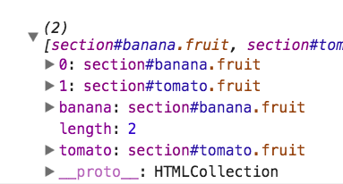
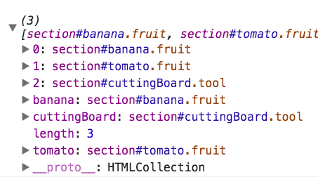

# Query & Manipulate the Browser DOM with JavaScript

## Query DOM

There are 3 main methods on the `document` object in JavaScript for querying information from the document object model of your HTML.

1. **getElementById** - This will return 1 DOM element or undefined.
1. **getElementsByClassName** - This will always return a collection. The collection will have 0-_n_ elements in it. 
1. **getElementsByTagName** - This will always return a collection. The collection will have 0-_n_ elements in it.

> **See for yourself:** The code below is in a [DOM Query JSFiddle](https://jsfiddle.net/chortlehoort/m3twofe2/) that you can run yourself. Just make sure you have your dev tools open to see the output.

```html
<html>
    <article>
        <section id="banana" class="fruit">
        Bananas
        </section>

        <section id="tomato" class="fruit">
        Tomato
        </section>

        <section id="cuttingBoard" class="tool">
        Cutting board
        </section>
    </article>
</html>
```

### By Id

To get a DOM element by its `id` attribute.

```js
const bananaElement = document.getElementById("banana")
```


### By Class

To get DOM elements by their `class` attribute. The following method will select both elements that have a class attribute with a value of fruit - so two elements.

```js
const fruitElements = document.getElementsByClassName("fruit")
```



### By Tag

To get a DOM element by its tag. The following method will select **all** section tags.

```js
const sectionElements = document.getElementsByTagName("section")
```



## Manipulate DOM

To update the contents of a DOM element, you simply need to assign a value to the `innerHTML` property of that element.

If I wanted to change the text inside the DOM element with the `id` of `banana`, this would be the code.

```js
const bananaElement = document.getElementById("banana")

bananaElement.innerHTML = "Mango"
```

## Videos to Watch

1. [JavaScript Tutorial For Beginners #33 - Traversing the DOM](https://www.youtube.com/watch?v=SowaJlX1uKA)
1. [Javascript Tutorial Part 8: Javascript getElementById](https://www.youtube.com/watch?v=Rk3bekL3TLc)
1. [JavaScript Tutorial for Beginners - 29 - getElementsByClassName](https://www.youtube.com/watch?v=ChLd2yFp-lA)
1. [JavaScript Tutorial for Beginners - 27 - getElementsByTagName method](https://www.youtube.com/watch?v=SwMgOMfelC8)
1. [JavaScript Tutorial for Beginners - 30 - Replace content using innerHTML](https://www.youtube.com/watch?v=dlaYyZ6vW48)

## Practice - Boy Bands and Vegetables

### Setup

```bash
mkdir -p ~/workspace/exercises/javascript/boybands && cd $_
touch index.html
touch boybands.js
```

### Requirements

Paste the following code into the `<body>` of the HTML file.

```html
<div id="boy-bands">
</div>

<div id="vegetables">
</div>
```

Paste the following code into your JavaScript file.

```js
var bands = ["Boyz II Men", "NSync", "New Kids on the Block", "98 Degrees", "One Direction"];
var vegetables = ["Carrots", "Kale", "Zucchini", "Broccoli", "Squash"];

// Get a reference to the appropriate DOM element for bands
const bandElement = document.getElementById(???);

// Get a reference to the appropriate DOM element for vegetables
const veggieElement = ???;

// Execute a for loop that will iterate over the arrays
for (var loopTracker = 0; loopTracker < ???; loopTracker += 1) {

  // Get a reference to the current item in the bands array
  const currentBand = ???;

  // Update the innerHTML value of the DOM element for bands

  // Get a reference to the current item in the vegetables array
  const currentVeggie = ???;

  // Update the innerHTML value of the DOM element for vegetables
}
```

Update the code to iterate the two arrays provided (`bands` and `vegetables`) and output each element in the arrays into their corresponding HTML `<div>` element. Ensure that each item is in a block element (e.g. li, div, p, etc...)

## Practice - Home Inventory

### Setup

```bash
mkdir -p ~/workspace/exercises/javascript/inventory-dom && cd $_
touch index.html
touch inventory.js
```

### Requirements

Paste the following code into the `<body>` of the HTML file.

```html
<html>
    <head>
        <title>My Home Inventory</title>
    </head>

    <body>
        <article class="inventory">

        </article>
    </body>

    <!-- Insert your script tag here -->
</html>
```

Paste the following code into your JavaScript file.

```js
const HomeInventory = JSON.parse(localStorage.getItem("homeInventory"))
```

Your task is to iterate over each object in your home inventory database, and insert a new `section` tag in the `article` tag to represent each item. Each section should follow the format below.

```html
<section class="furniture">
    <h2 class="furniture__name">
        Shaker Writing Desk
    </h2>
    <div class="furniture__location">
        Location: Bedroom
    </div>
    <div class="furniture__description">
        This antique desk is special because I found and purchased it with my wife at an Ohio Amish auction.
    </div>
</section>
```

### Optional Stretch Goal

Have a CSS class for each `type` of object in your inventory. Styles of your choice.
