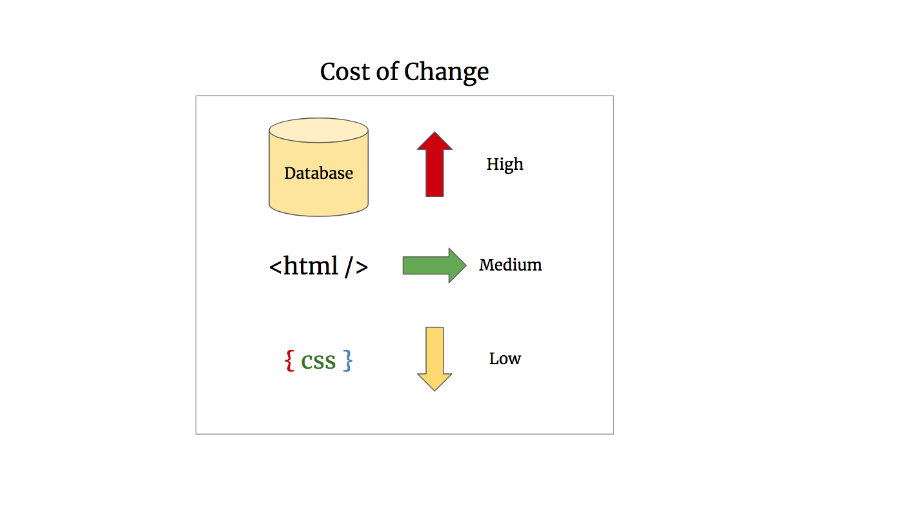
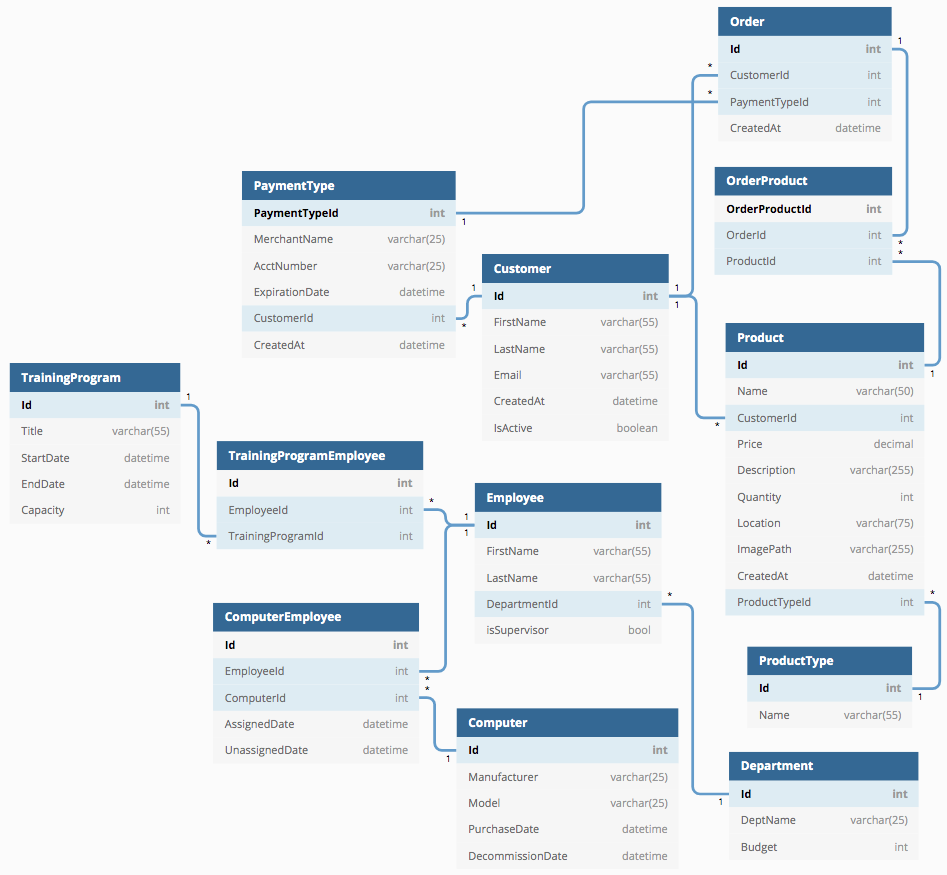
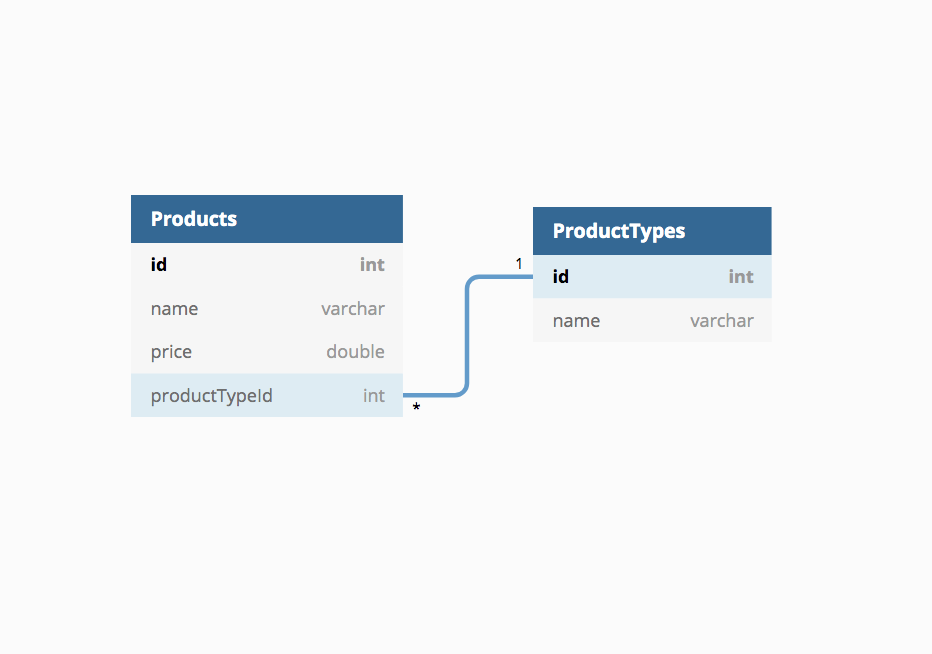

# Joining Data in Separate Objects

## Why Are You Learning This?

Properly structured and normalized databases can save a development team, and an entire business, hundreds of hours and millions of dollars over a pooly designed one. The database design is, by far, the most important thing to get right in an application because it is also is the hardest to change, and those changes affect everything about the application.



## Visualizing Relationships Between Data Sets

Entity Relationship Diagrams are used to visualize the relationships in a database. As human, we are visual creatures, and the ERD is the only way for us to understand a large, complex database made of thousands, millions, or billions of points of data.



## 1 -> &infin; (one to many) Relationships

Imagine that you are building an application that is an online marketplace. People can sell products in all kinds of categories.

### Data Structures

Here's a sample JSON file for your API for products being sold in the Candy and Electronics categories.

> ##### `database.json`

```json
{
    "productTypes": [
        { "id": 1, "name": "Candy" },
        { "id": 2, "name": "Electronics" }
    ],
    "products": [
        { "id": 1, "name": "Lollipop", "price": 1.49, "productTypeId": 1 },
        { "id": 2, "name": "iPad", "price": 799.99, "productTypeId": 2 },
        { "id": 3, "name": "Snickers", "price": 1.79, "productTypeId": 1 },
        { "id": 4, "name": "Baby Ruth", "price": 1.79, "productTypeId": 1 },
        { "id": 5, "name": "Xbox One", "price": 216.49, "productTypeId": 2 }
    ]
}
```

### Visualizing Product and Product Type Relationship

This ERD is the visualization of the data above. It shows how a single product type id can be stored in the products table multiple times.



## Joining the Data for HTML Representations

The data is separated in the database, but when you want to display HTML representations of the products to the user, you need to pull in the name of the product type from the other table. You don't want tell the user that a Baby Ruth's category is `1`.

1. Create a `~workspace/marketplace` directory
1. Create a `~workspace/marketplace/api` directory
1. Create a `~workspace/marketplace/api/database.json` file
1. Create a `~workspace/marketplace/index.html` file
1. Create a `~workspace/marketplace/scripts` directory
1. Create a `~workspace/marketplace/scripts/main.js` file
1. Create a `~workspace/marketplace/scripts/ProductTypeProvider.js` file
1. Create a `~workspace/marketplace/scripts/ProductProvider.js` file
1. Create a `~workspace/marketplace/scripts/ProductList.js` file
1. Create a `~workspace/marketplace/scripts/Product.js` file
1. Place the JSON from above in your `database.json` file.
1. Create an HTML element in your `index.html` with a class of `products`.

> ##### `marketplace/scripts/ProductTypeProvider.js`

```js
let types = []

export const useProductTypes = () => types.slice()

export const getProductTypes = () => fetch("http://localhost:8088/producttypes")
    .then(res => res.json())
    .then(parsedTypes => types = parsedTypes)
```

> ##### `marketplace/scripts/ProductProvider.js`

```js
let products = []

export const useProducts = () => products.slice()

export const getProducts = () => fetch("http://localhost:8088/products")
    .then(res => res.json())
    .then(parsedProducts => products = parsedProducts)
```

> ##### `marketplace/scripts/ProductList.js`

```js
import { useProducts } from "./ProductProvider.js"
import { useProductTypes } from "./ProductTypeProvider.js"
import Product from "./Product.js"

const contentTarget = document.querySelector(".products")

export const ProductList = () => {
    const products = useProducts()
    const productTypes = useProductTypes()

    const render = () => {
        contentTarget.innerHTML = products.map(product => {
            // Find this product's type
            const type = productTypes.find(type => type.id === product.productTypeId)

            // Get HTML representation of product
            const html = Product(product, type)

            return html
        }).join("")
    }

    render()
}

export default ProductList
```


> ##### `marketplace/scripts/Product.js`

```js
const Product = (product, type) => {
    return `
        <section class="product">
            <header>
                <h2>${product.name}</h2>
            </header>
            <div>
                In category ${type.name}
            </div>
        </section>
    `
}

export default Product
```


> ##### `marketplace/scripts/main.js`

```js
import { getProducts } from "./ProductProvider.js"
import { getProductTypes } from "./ProductTypeProvider.js"
import ProductList from "./ProductList.js"

getProducts()
    .then(getProductTypes)
    .then(ProductList)
```