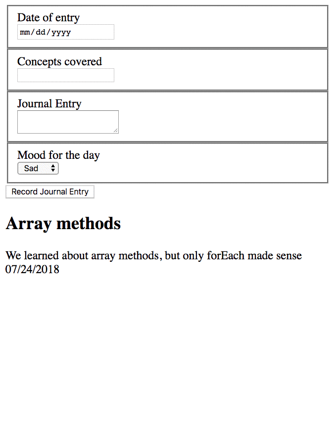

# Daily Journal

The learning objective for this chapter is to apply your knowledge of event listeners, and querying the DOM to make your daily journal form work and save entries to your API. You will also use `fetch` to make a POST request to your API, while using a factory function to generate the object that will be saved.

## Saving Entries



## Listen for Submit Button Click

In your main JavaScript module (`journal.js`) add a click event listener to the **Record Journal Entry** button at the bottom of your form. When the user clicks the button, you need to create a new entry in your API. The HTTP method that you use to create resources is POST. Guidance on syntax is provided below.

## Collect Form Field Values

1. Use `document.querySelector` to select your input fields.
1. Use the `.value` property on the input field elements to get the text that you typed/chose.

### Basic Input Validation

Use a conditional to ensure no blank entries. If any of the variables that you are using to store the `.value` property of the input fields is an empty string (`""`), then alert the user that the fields need to be complete.

## Journal Entry Factory Function

1. Create a `createEntry.js` module.
1. In that module, define a factory function whose responsibility is to generate an object that represents a journal entry. Make sure that it defines a parameter for each of the input fields on your daily journal form.
1. In the function, create a new object that has the same key/vaue pairs as what you have in your JSON file.
1. Then return the object.
1. In the `journal.js` module, import and invoke the factory function you created. Make sure you pass all four user input values to the function, in the correct order.

> **Note:** Your factory function returns a value. If a function returns a value, what do you need to do when you invoke it in `journal.js`?

## Using POST Method to Create Resources

Once you have the journal object being successfully created in your factory function, the next step is to get that object saved in the API (_i.e. your JSON file_).

You must use the `fetch` function to create your journal entry in the API. The default method is GET, so you've never had to specify and configuration options with your `fetch` statements before. However, with POST, you need to configure the request.

Here's an example. You will use this example below.

```js
const API = {
    saveJournalEntry: (newEntryObject) => {
        return fetch("put the URL to the API here", {
            method: "POST",
            headers: {
                "Content-Type": "application/json"
            },
            body: JSON.stringify(newEntryObject)
        })
    }
}

export default API
```

## Implementing the POST operation

* Add new method named `saveJournalEntry` to your data module (_see example above_). Notice that it defines a parameter to accept an object as input.
* Update the URL for the `fetch` function to the correct value.
* In the `journal.js` module, import and invoke the `saveJournalEntry` method after you have collected the input from the user.
* Remember the object you made with your factory function above? Make sure you pass that object as an argument to the `saveJournalEntry` method.

## Getting All Entries and Rendering Again

Now that the new object has been saved to the API, you need to get that new entry in the list that you render beneath the form in your UI.

1. Look in your `data.js` module. Which function in there is responsible for requesting all of the entries from the API?
1. Which function is responsible for sending the object to be saved in the API?
1. In one of your other modules, which function is responsible for rendering all the objects to the DOM? Look for an `.innerHTML +=`.

Once you have identified all of those functions, here is the pattern for making them work in the correct order. Remember that you are working with asynchronous operations when you do a GET or a POST. Which means you need to use `.then()` to ensure things work in the correct order.

In the code below, you replace the general names with the actual function names in your code that perform the actions.

```js
functionThatSendsObjectToAPI
    .then(() => {
        return functionThatGetsAllObjectsFromAPI()
    })
    .then((allObjectsFromAPI) => {
        return functionThatIteratesArrayAndRendersToDOM(allObjectsFromAPI)
    })
```

## Challenge: Advanced Form Validation

Add the following validation code to your journal entry form fields.

1. Pick a maximum length for concepts field and provide visual feedback _(e.g. alert box, or putting text in a blank div)_ if you type in a string that is longer than that maximum.
1. Test that the concept and entry fields contain no curse words. You can use regular expressions for that.

## Challenge: Entry Form Component

Create a module that defines a function for building the form fields dynamically instead of them being hard-coded in the HTML.

## Challenge: Creating Method Abstractions

Write a new method in your API module that performs both the POST and the GET in sequence, then use that method in the event listener code.
