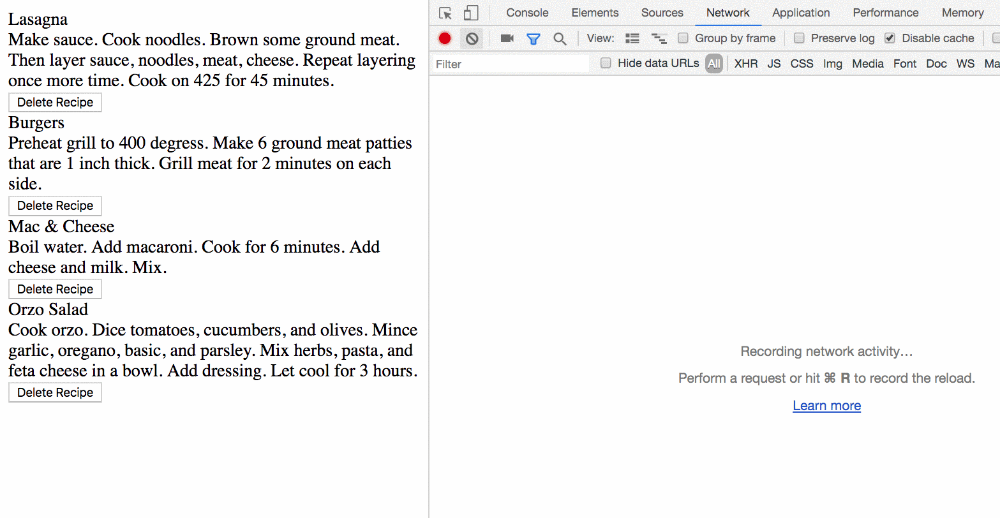

# Deleting Raw Data in an API

You have implemented the POST HTTP verb in order to create a new object in your API. Next is learning to use the DELETE verb to remove an object from your API.

## Learning Objectives

By the end of this chapter, you will have been shown the following techniques.

1. How to add a button in the DOM whose purpose it to initiate a DELETE operation for a particular resource.
1. How to dynamically add the unique identifier for a resource to the `id` attribute of the button responsible for deleting it.
1. How to listen for the click event on that button.
1. Determine which resource should be deleted by using the `split()` method on a string.
1. Perform a DELETE operation with the JavaScript Fetch API.
1. Ensure that the DELETE operation is complete, and then display all resources again.



## Setup

```sh
mkdir -p ~/workspace/recipeDelete && cd $_
mkdir api
cd api
touch recipes.json
cd ..
mkdir src
cd src
touch index.html
cd scripts
touch main.js dom.js api.js factory.js events.js
cd ..
code .
```

> **Idea:** Whew, that a lot of commands. I wonder if you could write a bash function that do all of that work for you.

## The Data

```json
{
    "recipes": [
        {
            "id": 1,
            "title": "Lasagna",
            "instructions": "Make sauce. Cook noodles. Brown some ground meat. Then layer sauce, noodles, meat, cheese. Repeat layering once more time. Cook on 425 for 45 minutes."
        },
        {
            "id": 2,
            "title": "Burgers",
            "instructions": "Preheat grill to 400 degress. Make 6 ground meat patties that are 1 inch thick. Grill meat for 2 minutes on each side."
        },
        {
            "id": 3,
            "title": "Mac & Cheese",
            "instructions": "Boil water. Add macaroni. Cook for 6 minutes. Add cheese and milk. Mix."
        },
        {
            "id": 4,
            "title": "Orzo Salad",
            "instructions": "Cook orzo. Dice tomatoes, cucumbers, and olives. Mince garlic, oregano, basic, and parsley. Mix herbs, pasta, and feta cheese in a bowl. Add dressing. Let cool for 3 hours."
        }
    ]
}
```

## List Container

First, specify an HTML element to hold the recipe information.

##### index.html

```html
<article id="recipeList"> </article>
```

## Recipe HTML

Now for a factory module to turn objects into HTML.

By placing the unique key of the resource you are creating in the `id` attribute of the `<button>` _(see below)_, you can use the JavaScript `split()` method to extract it when the button is clicked.

##### factory.js

```js
export default recipe => `
    <section class="recipe--${recipe.id}">
        <header class="recipe__title">
            ${recipe.title}
        </header>
        <div class="recipe__instructions">
            ${recipe.instructions}
        </div>
        <button id="deleteRecipe--${recipe.id}">
            Delete Recipe
        </button>
    </section>
`
```

## Display Data

A DOM module to render the recipe HTML representations.

##### dom.js

```js
import createRecipeCard from "./factory.js"

const recipeList = document.querySelector("#recipeList")

export default recipes => {
    // Clear the current content
    recipeList.textContent = ""

    // Fill container with recipe HTML representations
    for (const recipe of recipes) {
        const recipeCard = createRecipeCard(recipe)
        recipeList.innerHTML += recipeCard
    }
}
```

## Events Module

Now an events module to register the click handler on the list element. This module exports an object with one method named `registerDeleteListener`. This will be invoked in `main` module.

```js
import apiActions from "./api.js"
import render from "./dom.js"

const recipeList = document.querySelector("#recipeList")

export default {
    registerDeleteListener () {
        recipeList.addEventListener("click", event => {
            if (event.target.id.startsWith("deleteRecipe--")) {
                // Extract recipe id from the button's id attribute
                const recipeToDelete = event.target.id.split("--")[1]

                // Invoke the delete method, then get all recipes and render them
                apiActions.deleteRecipe(recipeToDelete)
                    .then(apiActions.getAllRecipes)
                    .then(render)
            }
        })
    }
}
```

## API Actions Module

There are two actions that need to be performed for this lesson.

1. Get all recipes
1. Delete a single recipe

This module will export an object with those two methods on it. Other modules can import the object and invoke either of the methods, depending on its needs.

```js
export default {
    deleteRecipe (recipeId) {
        return fetch(`http://localhost:8088/recipes/${recipeId}`, {
            method: "DELETE"
        })
            .then(response => response.json())
    },
    getAllRecipes () {
        return fetch("http://localhost:8088/recipes")
            .then(response => response.json())
    }
}
```

## Delete Request Syntax

Here is how you perform a deletion operation using the `fetch` syntax in JavaScript. You need to always include the `method` and the `Content-Type` header. Also note that the unique key of the resource to be deleted is a route parameter at the end of the URL.

```js
recipeList.addEventListener("click", event => {
    /*
        Only trigger the delete operation if the button
        was clicked. Remember that the side-effect of
        putting the "click" handler on the parent container
        is that if you click on _anything_ inside that
        element, the event will bubble up.
    */
    if (event.target.id.startsWith("deleteRecipe--")) {
        const recipeToDelete = event.target.id.split("--")[1]

        fetch(`http://localhost:8088/resource/${recipeToDelete}`, {
            method: "DELETE",
            headers: {
                "Content-Type": "application/json"
            }
        })
        .then(response => response.json())
    }
})
```

## Delete and Get All Option

Once you delete a resource in your API, you need to rebuild your list of HTML representations because the state of the API has changed. Remember that your HTML is simply a representation of your APIs current state, with affordances to change its state.

This means that you need to request all of the data again and go through the same process that executed when the page first loaded.

```js
recipeList.addEventListener("click", event => {
    if (event.target.id.startsWith("deleteRecipe--")) {
        const recipeToDelete = event.target.id.split("--")[1]

        fetch(`http://localhost:8088/recipes/${recipeToDelete}`, {
            method: "DELETE"
        })
        .then(response => response.json())
        // Get all recipes once the DELETE request is resolved
        .then(getRecipes)
    }
})
```