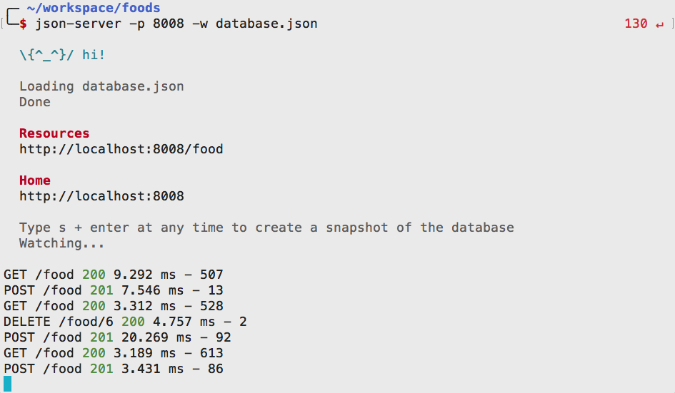
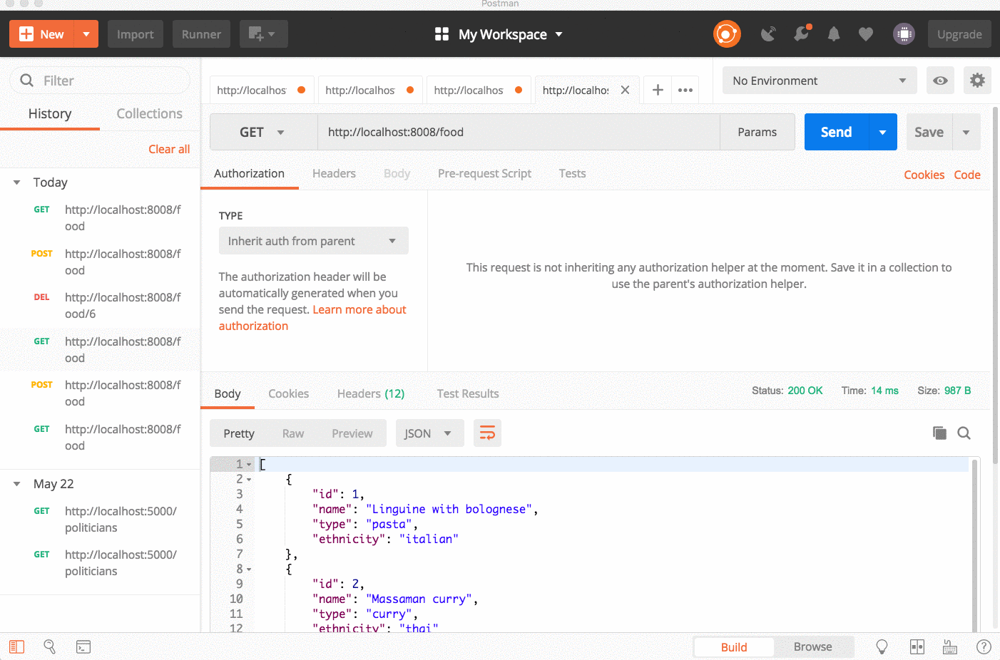

# API: Make Your Data Stick Around With Peristent Storage

Up to this point, you've created and interacted with data within the context of your application code. However, you may have noticed that any changes to that data (updates, deletions, additions) go away when you close the browser or refresh the page.

In this chapter, you are going to use a tool called `json-server` to store your application's data in JSON format on your file system instead. This will allow the data to persist from browser session to browser session.

Visit the Github [repo for json-server](https://github.com/typicode/json-server) if you want to learn more details.

## Setup

### Install JSON Server

```sh
npm install -g json-server
```

### Create the API

You are going to create an API (application programming interface) that you will use to store and retrieve information your favorite foods.

```sh
mkdir -p ~/workspace/javascript/exercises/food-api/api
cd $_
touch database.json
```

Next, pre-populate your API with some of your favorite foods. Each object should have the following keys.

1. Name (_string_)
1. Type (_string_)
1. Ethnicity (_string_)
1. Side dishes (_array_)

> Example data in `database.json`

```json
{
    "food": [
    {
        "id": 1,
        "name": "Linguine",
        "type": "pasta",
        "ethnicity": "italian"
    },
    {
        "id": 2,
        "name": "Massaman curry",
        "type": "curry",
        "ethnicity": "thai"
    },
    {
        "id": 3,
        "name": "Green curry",
        "type": "curry",
        "ethnicity": "thai"
    },
    {
        "id": 4,
        "name": "Ravioli Funghi",
        "type": "pasta",
        "ethnicity": "italian"
    },
    {
        "id": 5,
        "name": "Tuscan Soup",
        "type": "vegetarian",
        "ethnicity": "italian"
    }
    ]
}
```

Now that the routes are configured and you have some data, you can start your API with the following command.

**_Make sure you are in the `api` directory of your project._**

```sh
json-server -p 8088 -w database.json
```

Go to Chrome and go to the following URL.

[http://localhost:8088/food](http://localhost:8088/food)

You will see a JSON representation of all of your favorite foods.

## API Output

Each request that your browser makes to the API will be output in the terminal. Here's an example of what it looks like, and what everything means.



You see a list of requests above. Each line shows the following information.

1. HTTP Verb _(e.g. GET, POST, DELETE)_
1. Resource _(e.g. /food/6)_
1. Status code _(`200` means ok, `201` means something was created)_
1. Time to complete request in milliseconds
1. Size of response in bytes

## Filtering Data

Now filter the food to only show Italian dishes

[http://localhost:8088/food?ethnicity=italian](http://localhost:8088/food?ethnicity=italian)

Or curry dishes.

[http://localhost:8088/food?type=curry](http://localhost:8088/food?type=curry)

## Using Postman for API Queries

Postman is a valuable tool for software developers who want to explore any API resources. When you are building your own API for a group project, or when you are building one for a personal project or your capstone, Postman will help you test the API before you starting writing your application code.

1. Visit the [Postman apps page](https://www.getpostman.com/apps) and download the application for your OS.
1. Watch the wonderful [Postman Beginner Tutorial](https://www.youtube.com/playlist?list=PLhW3qG5bs-L-oT0GenwPLcJAPD_SiFK3C) series on YouTube.

## Practice

Practice using Postman to perform GET, POST, PUT, and DELETE operations on your new food API.

1. GET all curry dishes. Use the [filter feature](https://github.com/typicode/json-server#filter).
1. Use POST to create some of your favorite foods.
1. Perform a GET operation using the [`q` URL parameter](https://github.com/typicode/json-server#full-text-search) to find any entries that have the pattern of `ol` in them.
1. GET all foods and [sort](https://github.com/typicode/json-server#sort) them by ethnicity.
1. Delete a food from the API by using the DELETE method, and putting in the URL of a specific resource (e.g. `http://localhost:8008/food/2`)

### How to use Postman to POST


