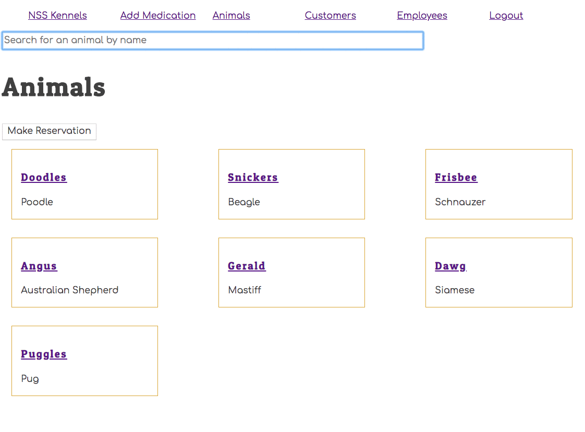

# Searching Animals

Right now, the list of animals just displays the entire state of animals in your application. In this chapter, you are going to be introduced to working with component state, which may be different than the application state or the API state.

You are going to implement a search feature where you can type in letters and the animal list will render any animal name that matches what you typed in. So the state of the animal list will be different than the state of the application or API. It could only display 2 animals, whereas there are 20 animals total.



## Step 1 - Create a Search Component

##### **`src/components/animals/AnimalSearch.js`**

```jsx
import React, { useRef } from "react"
import "./Animals.css"

export default () => {
    const search = useRef()

    return <input type="text"
                ref={search}
                className="input--animalSearch"
                name="animalSearch"
                placeholder="Search for an animal by name" />
}
```

## Step 2 - Render Search Component as Sibling of List

##### **`src/components/ApplicationViews.js`**

```jsx
<Route exact path="/animals" render={
    props => {
        return <>
            <AnimalSearch {...props} />
            <AnimalList {...props} />
        </>
    }
} />
```

## Step 3 - Add Search State to Parent Provider Component

##### **`src/components/animals/AnimalProvider.js`**

Add the new `searchTerm` state shown below.

```jsx

export const AnimalProvider = (props) => {
    const [animals, setAnimals] = useState([])
    const [searchTerm, setSearchTerm] = useState("")
```

THen make sure you add the state variable and the setter to the value object of the context.

```jsx
<AnimalContext.Provider value={
    {
        animals, addAnimal, releaseAnimal,
        updateAnimal, setSearchTerm, searchTerm,
        setAnimals
    }
}>
    {props.children}
</AnimalContext.Provider>
```

## Step 4 - Search Component Sets State

##### **`src/components/animals/AnimalSearch.js`**

```jsx
import React, { useRef } from "react"
import { AnimalContext } from "./AnimalProvider"
import "./Animal.css"

export default () => {
    const search = useRef()
    const { setSearchTerm } = React.useContext(AnimalContext)

    return (
        <>
            <input type="text"
                   ref={search}
                   className="input--animalSearch"
                   onKeyUp={ e => setSearchTerm(search.current.value) }
                   name="animalSearch"
                   placeholder="Search for an animal by name" />
        </>
    )
}
```

## Step 5 - List Component Reacts to State Change

We'll talk about this.

##### **`src/components/animals/AnimalList.js`**

```jsx
import React, { useContext, useEffect, useState } from "react"
import { AnimalContext } from "./AnimalProvider"
import Animal from "./Animal"
import "./Animals.css"

export default (props) => {
    const { animals, searchTerm, setAnimals } = useContext(AnimalContext)
    const [ filteredAnimals, setFiltered ] = useState([])

    useEffect(() => {
        const subset = animals.filter(animal => animal.name.toLowerCase().includes(searchTerm))
        setFiltered(subset)
    }, [searchTerm])

    useEffect(() => {
        setFiltered(animals)
    }, [animals])

    return (
        <>
            <h1>Animals</h1>

            <button onClick={() => props.history.push("/animals/create")}>
                Make Reservation
            </button>
            <div className="animals">
                {
                    filteredAnimals.map(animal => {
                        return <Animal key={animal.id} animal={animal} />
                    })
                }
            </div>
        </>
    )
}
```