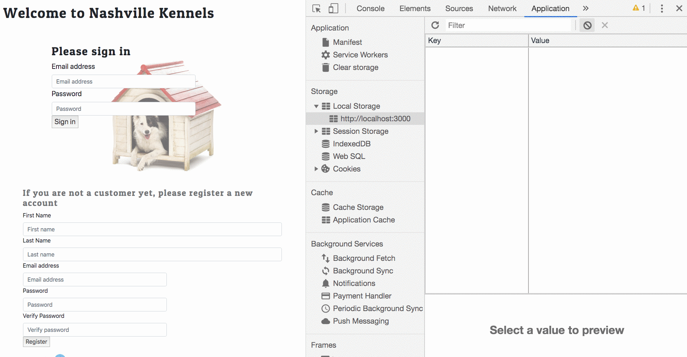

# Mock Authentication

> **Instructor Note:** Authentication is not a learning objective of your time here at NSS. The code in this chapter is intended to be copied and used, but not understood for now. Your job is still to render UI components using related data.

In this chapter, you are going to enable two things:

1. A login form where a customer can enter in their email address, and a password.
1. A registration form where the user can enter their name, email, and password.

This is not going to be a real authentication system. Real authentication systems are vastly more secure, complex, and robust.

The best part about this chapter is that you don't need to understand **any of it**. Follow the instructions, verify that registration and login works, or talk to your instructors if it doesn't so they can fix it.

Here's the process that this code follows.

1. When the application first renders, it checks for a `kennel_customer` item in local storage.
1. If the item is there, the user is authenticated and the application renders.
1. If the item is not there, render the Login form instead.
1. When the user fills out the form and clicks the submit button, query the API to see if a user with the specified email already exists.
1. If the user already exists, and the passwords match, set the `kennel_customer` item in local storage, and display the Dashboard.
1. If the user exists, but the passwords don't match, display an alert about that to the user.
1. If the user does not exist, alert that fact to the user.

## Requiring User to Login

What determines if a user has authenticated? It's the `kennel_customer` key that you set in local storage. If that key exists, the user is authenticated. If it does not exist, the user is not authenticated and should be presented with the login component.

Since this is now going to be the new responsiblity of the **`Kennel`** component, rename your current `Kennel.js` file `Dashboard.js`. Then make `Kennel.js` again and place the following code into it.


> ##### `src/components/Kennel.js`

```js
import React, { useState } from "react"
import Dashboard from "./Dashboard"
import Auth from "./auth/Auth"

export default () => {
    const [check, update] = useState(false)
    const toggle = () => update(!check)

    return (
        localStorage.getItem("kennel_customer") ? <Dashboard /> : <Auth toggle={toggle} />
    )
}
```

## Installing Authentication Components

Now you can install the mock authentication components into your application.

1. In the terminal, make sure you are in the `kennels` directory.
1. Run the following command in that directory.

    ```sh
    /bin/bash -c "$(curl -fsSL https://raw.githubusercontent.com/nashville-software-school/client-side-mastery/cohort-39/book-4-nashville-kennels/chapters/scripts/auth.sh)"
    ```
1. Go to Visual Studio Code and you will see a new `src/components/auth` directory with 5 new files in it.
    1. `logo.png`
    1. `Auth.css`
    1. `Auth.js`
    1. `Login.js`
    1. `Register.js`

## Register an Account

Once you have made all these changes, you should be presented with the Register/Login view. Create an account by filling out the registration form. When you complete that, you will immediately see your Dashboard.

You will also now see a new entry in your local storage.

