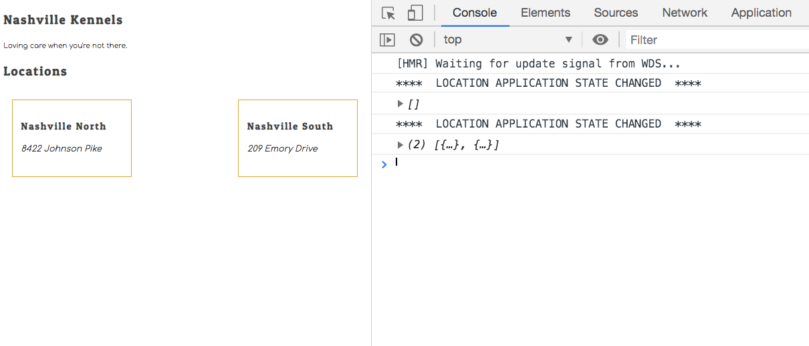

# Listing Locations from the Database

Now it's time to get the location data from the API and then refactor the **`Location`** component to display the live data instead of it being hard-coded.

## Location List

But first, you need to define your list component. This component is the first one in the application that needs data from a data provider component. Note that the `LocationContext` is imported from the **`LocationProvider`** component.

> ##### `src/components/location/LocationList.js`

```js
import React, { useContext } from "react"
import { LocationContext } from "./LocationProvider"
import { Location } from "./Location"
import "./Locations.css"

export const LocationList = () => {
    const { locations } = useContext(LocationContext)

    return (
        <div className="locations">
        {
            locations.map(loc => <Location key={loc.id} location={loc} />)
        }
        </div>
    )
}
```

### Breaking it Down

In the above component, you will notice a new hook being imported from React - the Context hook. This hook allows you to use data structures and functions that a parent provider component exposes. In the previous chapter, your **`LocationProvider`** component exposed the following two elements.

* The `locations` array
* The `addLocations` function

Right now, all you need is the array, so that's all you will explicitly use.

```js
const { locations } = useContext(LocationContext)
```

You need to import the context object that you create in a provider component so that the Context hook can access the objects that it exposes.

```js
import { LocationContext } from "./LocationProvider"
```

Lastly, just as you have been doing, you need to use the `.map()` array method to iterate the array of locations and generate HTML for each one by invoking the **`Location`** component function.

```js
{
    locations.map(loc => <Location key={loc.id} location={loc} />)
}
```

Note that even though it looks like you are specifying an HTML component, you are actually invoking a function. Also, the `key` and `location` arguments look like HTML attributes here, but they acutally become properties on an object that gets passed as an argument.

It is the equivalent of writing the following code.

```js
const properties = {
    key: loc.id,
    location: loc
}

Location(properties)
```

In React, that gets shortened to the following JSX.

```jsx
<Location key={loc.id} location={loc} />
```

## Wrapping Location List with Data

Now you need to refactor your Kennel component. You are going to start using live data, so you will be removing all the hard-coded components. Replace the contents of your component with the code below.

> ##### `src/components/Kennel.js`

```jsx
import React from "react"
import { LocationList } from "./location/LocationList"
import { LocationProvider } from "./location/LocationProvider"
import "./Kennel.css"

export const Kennel = () => (
    <>
        <h2>Nashville Kennels</h2>
        <small>Loving care when you're not there.</small>

        <h2>Locations</h2>
        <LocationProvider>
            <LocationList />
        </LocationProvider>
    </>
)
```

Note that the location list component is a child of the location provider component. It is crucial that you wrap components that need data with the provider component that exposes that data in JSX. You can wrap a component in as many providers as needed.

For example, if you needed information about animals in the location list component, you could do this.

```html
<h2>Locations</h2>
<LocationProvider>
    <AnimalProvider>
        <LocationList />
    </AnimalProvider>
</LocationProvider>
```

You will see more about this in later chapters.


## Location

Refactor your **`Location`** component to use the location property that was provided by the parent component of **`LocationList`**.

> ##### `src/components/location/Location.js`

```js
import React from "react"

export const Location = ({ location }) => (
    <section className="location">
        <h3 className="location__name">{location.name}</h3>
        <address className="location__address">{location.address}</address>
    </section>
)
```

Once all three of the components are complete, you should see two HTML representations of the locations in your API database, and also the two console logs of when the application state for locations changed.

1. First, when the provider component was initialized.
1. Second, when the state was retrieved from the API.

