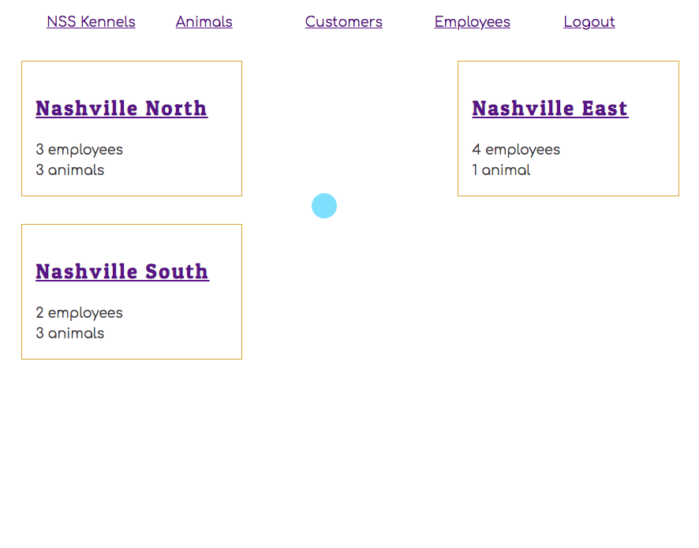

# Viewing Details in Modal

In this chapter, you will be learning how to use modals to display information. It could be details of a resource or a form for creating/editing something.

So far you are listing all employees, all animals, all customers, and all locations. By the end of the chapter, you will be able to click on one of the cards in the list view and only view the details of a specific item.

You are going to start with animals.

```js
import React from "react"
import { Button, Modal, ModalHeader, ModalBody, ModalFooter } from 'reactstrap';
import "./Animals.css"

export default ({ animal, location, customer }) => {
    const [modal, setModal] = useState(false)
    const toggle = () => setModal(!modal)

    return (
        <>
            <section className="animal">
                <h3 className="animal__name"> { animal.name } </h3>
                <div className="animal__breed">{ animal.breed }</div>
                <button onClick={toggle}>Details</button>
            </section>

            <Modal isOpen={modal} toggle={toggle}>
                <ModalHeader toggle={toggle}>
                    { animal.name }
                </ModalHeader>
                <ModalBody>
                    <div className="animal__breed">{ animal.breed }</div>
                    <div className="animal__location">Location: { location.name }</div>
                    <div className="animal__owner">Customer: { customer.name }</div>
                </ModalBody>
                <ModalFooter>
                    <Button color="secondary" onClick={toggle}>Close</Button>
                </ModalFooter>
            </Modal>
        </>
    )
}
```

## Practice: Employees

In the list of employees, only show the employee name with a details button next to it. When the user clicks on the button, display the employee's home address and kennel at which the employee works.

## Practice: Locations

Your next task is to refactor your location components. On your location list, display the location name, the number of animals currently being treated, and the number of employees.

When you click the name of a location, you should be taken to a detail view that lists the names of all animals currently being treated, and the names of all employees working there.

> **Tip:** You don't need all of the fancy styling like you see below. Just get the information displayed.

