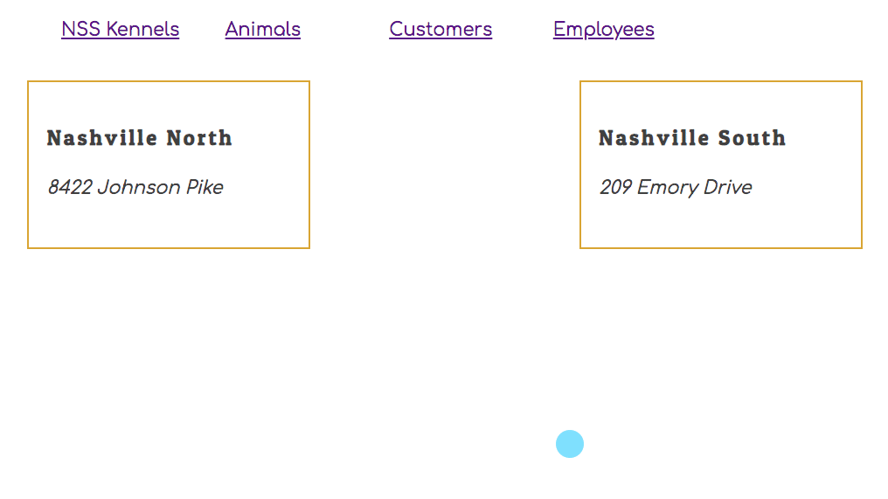

# Routing in React Applications

In a single page application, you are only rendering one DOM tree. You never request another HTML file but create/destroy components in the one you have. If you have multiple views in your application, a universal design pattern is to have a navigation element on the page for users to select and see different views.

In React, you will use something called a Router to handle the rendering of different components when the user clicks on navigation items. This also allows users to bookmark specific places within a single page app.

## Setup

Make sure you are in your project's root directory. First, we need to install `react-router-dom`. Then we will create an additional file to handle the routing and create a navbar.

```sh
npm i --save react-router-dom
cd src/components
touch ApplicationViews.js
mkdir nav
touch nav/NavBar.js
touch nav/NavBar.css
```

## Making Your Components

Here's what we are about to do:

1. Create the **`NavBar`** component for the constant navigation elements
1. Create the **`ApplicationViews`** component. This will define all of the URLs your application will support and which views will be displayed for each one.
1. Change the **`Kennel`** component to display two child components.
1. Update the **`index.js`** to utilize `react-router-dom`.

### NavBar Component

Use this code for your navigation bar and the following CSS.

> ##### `src/components/nav/NavBar.js`

```js
import React from "react"
import { Link } from "react-router-dom"
import "./NavBar.css"

export default (props) => {
    return (
        <ul className="navbar">
            <li className="navbar__item active">
                <Link className="navbar__link" to="/">NSS Kennels</Link>
            </li>
            <li className="navbar__item">
                <Link className="navbar__link" to="/animals">Animals</Link>
            </li>
            <li className="navbar__item">
                <Link className="navbar__link" to="/customers">Customers</Link>
            </li>
            <li className="navbar__item">
                <Link className="navbar__link" to="/employees">Employees</Link>
            </li>
        </ul>
    )
}
```

> ##### `src/components/nav/NavBar.css`

```css
.navbar {
    display: flex;
    flex-wrap: nowrap;
    justify-content: left;
}

.navbar__item {
    flex-basis: 20%;
    list-style-type: none;
}
```

Notice the use of the `<Link/>` component. This comes from the React Router package you installed. It has an attribute named `to`. It will render a hyperlink in your DOM, and when clicked, it will change the URL in the browser to the value of the `to` attribute.

### Defining the Routes of the Application

Now it's time to define the Routes for our application. In **`NavBar`**, you defined four **`<Link />`** components that will navigate to the routes of...

* `/`
* `/animals`
* `/customers`
* `/employees`

In the **`ApplicationViews`** component, you will define how your application will respond when the URL matches each of those patterns. When a user clicks on one of the hyperlinks in the navigation bar, this code dictates which component should be rendered.

> ##### `src/components/ApplicationViews.js`

```js
import React from "react"
import { Route } from "react-router-dom"
import { LocationProvider } from "./location/LocationProvider"
import { AnimalProvider } from "./animal/AnimalProvider"
import LocationList from "./location/LocationList"
import AnimalList from "./animal/AnimalList"

export default (props) => {
    return (
        <>
            <LocationProvider>
                {/* Render the location list when http://localhost:3000/ */}
                <Route exact path="/">
                    <LocationList />
                </Route>
            </LocationProvider>

            <AnimalProvider>
                {/* Render the animal list when http://localhost:3000/animals */}
                <Route path="/animals">
                    <AnimalList />
                </Route>
            </AnimalProvider>
        </>
    )
}
```

`exact` is needed on the first route, otherwise it will also match the other two routes, and the **`LocationList`** will be the only component rendered, no matter what the URL is.

The `<Link/>` and the `<Route/>` JSX elements are complementary to each other. If you add a new **`Link`** element in your application with a new URL, then you must create a matching **`Route`** element.

### Updating the Kennel Component

As mentioned above, **`Kennel`** is a container component. It renders no HTML itself. It simply *contains* other components that are responsible for the presentation and behavior of the application. In the case of our Kennel, it contains two different kinds of components.

1. **`NavBar`**: This is a _Presentation Component_. Directly expresses HTML.
2. **`ApplicationViews`**: This is a _Controller Component_. Its only responsibility to to control the behavior of the system and maps URLs to components.

> ##### `src/components/Kennel.js`

```js
import React from "react"
import { Route } from "react-router-dom"
import NavBar from "./nav/NavBar"
import ApplicationViews from "./ApplicationViews"
import "./Kennel.css"

export default () => (
    <>
        <NavBar />
        <ApplicationViews />
    </>
)
```

Now update your `index.js` by adding a root component of `<Router />` which gets imported from the React Router package. Within **`<Router>`**, place the `<Kennel />` child component. This tells React *"I will be placing Routes in my Kennel component."*

> ##### `src/index.js`

```js
import React from "react"
import ReactDOM from "react-dom"
import { BrowserRouter as Router } from "react-router-dom"
import Kennel from "./components/Kennel"

ReactDOM.render(
    <Router>
        <Kennel />
    </Router>
    , document.getElementById("root"))
```

When all of this code is in place, your location list and animal list should display HTML representations of the data in your database.



## Practice: Customers and Employees

Your job is to update **`ApplicationViews`** to make the _Customers_ and _Employees_ links display their matching resources when clicked. Ensure that you have each list component as a child of a provider component.