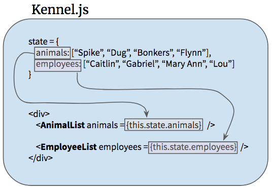
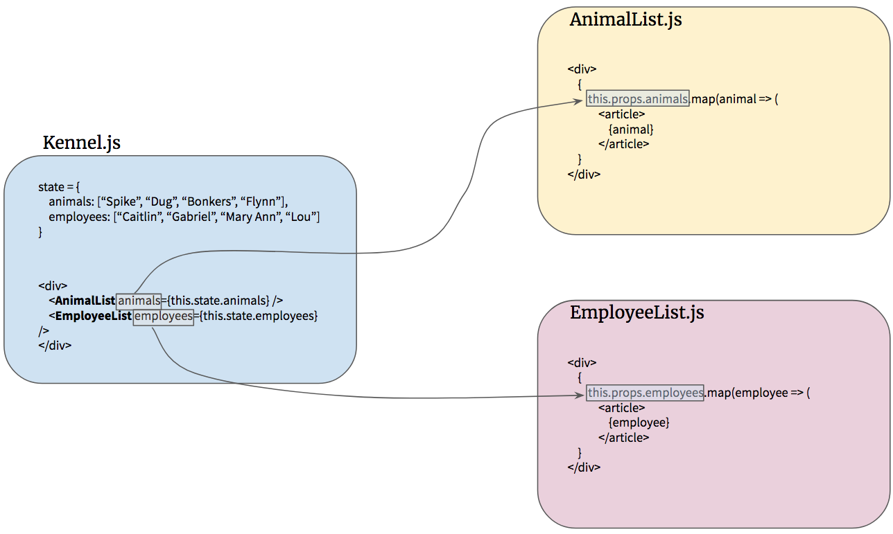

# React Component State and Props

In this chapter, you are going to make your application dynamic. In React, data can be passed to components. This is similar to passing arguments to functions, yet different.

## State in React Applications

State is the current values of the properties used to render a component. Your brain will try to make it more complex than that, so remember this statement.

> State is the current values of the properties used to render a component.

Think of a component as a template waiting for data to be passed in and then displayed. A single component can be made up of several smaller components.

State is initialized by defining `state` at the top of a class definition and then is automatically included in the construction of the component. Currently our **`<AnimalList />`** has the state of animals defined as an empty array. Once we get the the data from the API we invoke `setState()` with the animal data. This will change the state and **Each time `state` changes, the `render()` method of that component runs.**

Now we want to use the new data to populate our animal cards. We pass the data to the **`<AnimalCard />`** with **props**. Change the render method of the **`AnimalList`** component:


```js
render(){
        console.log("AnimalList: Render");

        return(
            <div className="cards">
                {this.state.animals.map(animal =>
                    <AnimalCard key={animal.id} animal={animal} />
                )}
            </div>
        )
    }
```

**What is the key?** Each child in a list should have a unique "key" prop. This is how React keeps track of re-rendering only the things that have changed.

**In English** Using the array method `map`, for each item/animal in the array animals, return an **`<AnimalCard />`** and pass the single item/animal into it via props.

Because **`<AnimalCard />`** is included in the render method of **`<AnimalList />`**, it is a  _child component_ of the **`<AnimalList />`** component.

* Use the Chrome React Developer tool and inspect the **`<AnimalCard />`** component. You will notice that each card has props for one animal.

Modify the **`<AnimalCard />`** render method to display the props using dot notation.

```js
    render() {
        return (
            <div className="card">
                <div className="card-content">
                    <picture>
                      
                    </picture>
                    <h2>Name: <span style={{color: 'darkslategrey'}}>{this.props.animal.name}</span></h2>
                    <p>Breed: {this.props.animal.breed}</p>
            </div>
        );
    }

```

Add CSS. Note: you will import a single CSS file directly into this component. Good practice would to only import CSS that applies to the JSX elements of this component.


> components/animal/Animal.css

```css
.card {
  /* Add shadows to create the "card" effect */
  box-shadow: 0 4px 8px 0 rgba(0,0,0,0.2);
  transition: 0.3s;
  border-radius: 5px; /* 5px rounded corners */
  background: aliceblue;
  margin-bottom: 2em;
  flex: 0 1 24%;
}

.card-content {
	padding: .5em;
}

.card-content h3 {
	margin-top: 0;
	margin-bottom: .5em;
  font-weight: bold;
  color: rgb(43, 112, 241);
}

.card-content p {
  font-size: 80%;
  color: darkslategrey;
}

.card button {
  background-color: cornflowerblue;
  border: none;
  color: cornsilk;
  text-align: center;
  text-decoration: none;
  display: inline-block;
  font-size: 14px;
  padding: .5em;
  border-radius: 2px;
  margin: .1em;
  width: 100%;
}

.card button:hover {
  background-color: darkblue;
}
```

## Using State in a Component



## Passing State to a Child Component




## Expressing State as HTML

An important aspect of understanding why React works the way it does is to realize that its core mechanism is to **_express state as HTML_**.

Gone are the days of using Vanilla JavaScript or jQuery to directly manipulate your DOM. You should never write an `appendChild()`, or `$("#something").empty()` in your code.

State is at the core of React. It drives everything. Including the HTML representation of that state via JSX. If you want to change the DOM that is displayed to your customer, you **change the state of the component**.

To change `state`, you _must_ use `this.setState()`, and that method, in turn, invokes the `render()` method. **Changing state is the only way to modify the DOM.**

* If you remove an item from a collection(array) in state, then that element will not be rendered.
* If you add an item to a collection in state, then it will be rendered.
* If you modify an object that is used in your JSX, then it will change when the component is re-rendered.

### A Few Rules for state and props
* State is passed to children components as props.
* Props are read only.
* State can only be changed via the `setState()` function in the component that owns state.
* `setState()` automatically invokes the render method.


---

## Practice Exercise - Displaying Data

Update your application so that each section displays a list of cards with the API data.


## Practice Exercise - Multiple Database calls
1. Modify your API to include an employeeId for each pet.
2. Within the **`<AnimalList />`** component get the employee data and within each **`<AnimalCard />`** display the employee responsible for each pet.
3. When changing multiple items in state, it is good practice to set a variable equal to the new data and then call `setState()` only once.

```js
    componentDidMount() {
        const newState = {}

        fetch("http://localhost:5002/animals")
            .then(r => r.json())
            .then(animals => newState.animals = animals)
            .then(() => fetch("http://localhost:5002/employees")
            .then(r => r.json()))
            .then(employees => newState.employees = employees)
            .then(() => this.setState(newState))
    }
```
*[You could also use json-server "Relationships"](https://github.com/typicode/json-server)*


## Challenge: Animal Owners

> Remember, challenges are completely optional and should not be attempted until you have done the practice exercises and understand the basic concepts.

1. Create a join table and assign each animal to an owner.

Your task is to update the **`<AnimalCard />`** component to also display the name of the animal's owner(s). Keep in mind that the animal may have more than one owner.

You will need to load the owner's data within the **`<AnimalList />`** and then pass the owner's details to the **`<AnimalCard />`** component.


