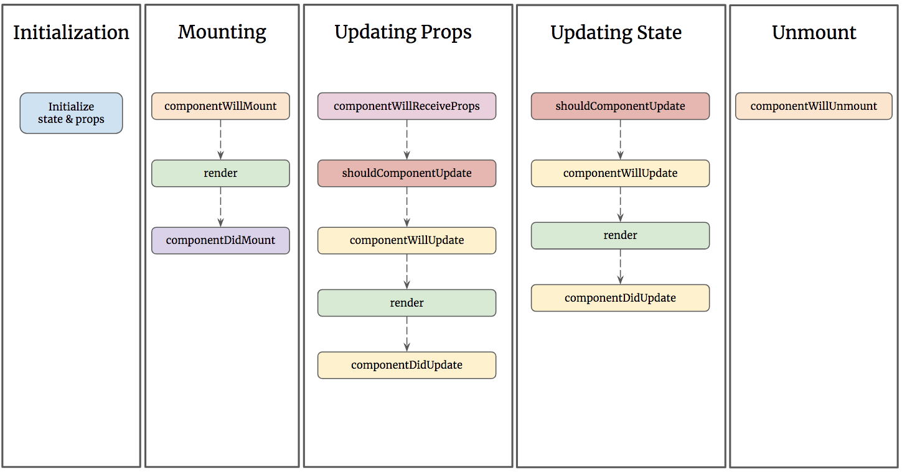

# React

React is a library that was open sourced by the development team at Facebook with the sole purpose of managing how data is displayed to the user. It doesn't care about the database, it doesn't care how data is retrieved, and doesn't care about how complex the rest of the application is.

You've already learned the vast majority of what React does for you when building the UI for your application.

1. Building components and child components
1. Modular code with Browserify modules
1. Updating the DOM with document fragments and appendChild
1. Setting the state of a component

## Key Terms

1. **JSX** — Allows us to write HTML like syntax which gets
transformed to lightweightJavaScript objects.

1. **render** (method) — Describes what the UI will look like for the particular component.

1. **Virtual DOM** — A JavaScript representation of the actual DOM.

1. **state** — The internal data store (object) of a component.

1. **setState** — A helper method used for updating the state of a component and re-rendering the UI

1. **React.Component** — The way in which you create a new component.

1. **ReactDOM.render** — Renders a React component to a DOM node.

1. **constructor** (this.state) - The way in which you establish the initial state of a component.

1. **props** — The data which is passed to the child component from the parent component.

1. **propTypes** — Allows you to control the presence, or types of certain props passed to the child component.

1. **defaultProps** — Allows you to set default props for your component.

## Component LifeCycle



## Common Events

1. onClick
1. onSubmit
1. onChange

## Getting Started with create-react-app

Visit the [create-react-app](https://github.com/facebook/create-react-app/) Github repo and follow the instructions for getting yourself set up with a simple React application.

## Resources

1. [A Comprehensive Guide to learning React.js in 2018](https://tylermcginnis.com/reactjs-tutorial-a-comprehensive-guide-to-building-apps-with-react/)
1. Video: [React Tutorial Series](https://www.youtube.com/watch?v=MhkGQAoc7bc&list=PLoYCgNOIyGABj2GQSlDRjgvXtqfDxKm5b)

## Examples

### Single Component

Here's the simplest of examples for building a React component. In your `index.js` file, place the following code that building a `<Me />` component that renders information about yourself.

```js
import ReactDOM from 'react-dom';
import React, { Component } from 'react';

class Me extends Component {
    render() {
        return (
            <div>
                <h3>Thomas Bangs</h3>
                <h4>Evening Cohort 1</h4>
                <h5>Nashville Software School</h5>
            </div>
        );
    }
}

ReactDOM.render(<Me />, document.querySelector("root"));
```

### Child Component

To further describe myself, I'm going to create another component that represents my home address.

```js
class Home extends Component {
    render() {
        return (
            <div>
                <h5>1000 Inifinity Way</h5>
            </div>
        );
    }
}
```

Then I can include that component as a child of the `Me` component.

```js
class Me extends Component {
    render() {
        return (
            <div>
                <h3>Thomas Bangs</h3>
                <h4>Evening Cohort 1</h4>
                <h5>Nashville Software School</h5>
                <Home />
            </div>
        );
    }
}
```

> **Note:** Each React component's render method can only have a single component defined in it. Notice that each of my simple components above only define a single `<div>` with child elements.

### Component Files

Before we grow this application any further, we need to separate each component into its own JavaScript file.

> Home.js

```js
import React, { Component } from 'react'

class Home extends Component {
    render() {
        return (
            <div>
                <h5>1000 Inifinity Way</h5>
            </div>
        );
    }
}

export default Home
```

> Me.js

```js
import React, { Component } from 'react'
import Home from "./Home"  // Import the Home component


class Me extends Component {
    render() {
        return (
            <div>
                <h3>Thomas Bangs</h3>
                <h4>Evening Cohort 1</h4>
                <h5>Nashville Software School</h5>
                <Home />
            </div>
        );
    }
}

export default Me
```

> index.js

```js
import ReactDOM from "react-dom"
import React from 'react'
import Me from "./Me"

ReactDOM.render(<Me />, document.querySelector("#root"));
```

## Practice

You're going to create a component named after yourself (e.g. `<Thomas />`, or `<Evelyn />` or `<Priya />`). It should contain the following information.

1. Your full name
1. Your cohort
1. Your home address
1. The make and model of your favorite vehicle
1. The name, and species/breed of your favorite, or ideal, pet

Make sure you author components for each unique object being represented and compose them into the component named after you.
