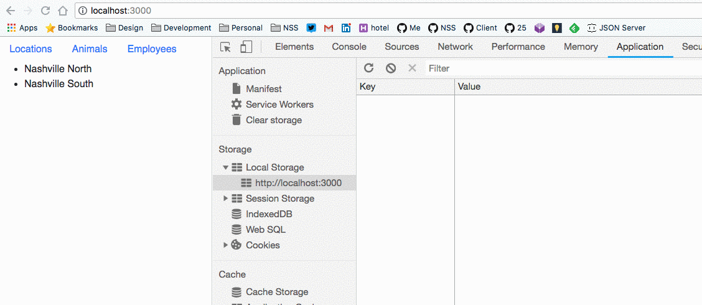
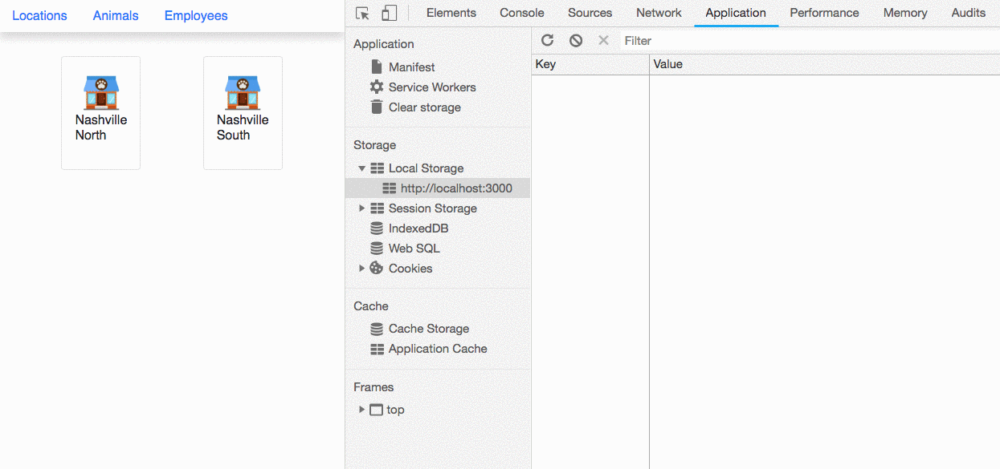
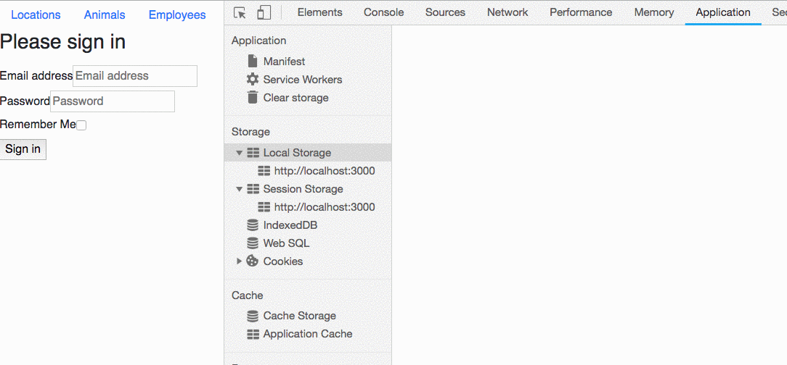

# Conditional Route Rendering

In this chapter, you are going to learn how to configure a `<Route>` to conditionally render one component or another.

## Checking for Simple Authentication

**Note:** The example code below contains an extremely simplified login process. This is not a guide to proper authentication. The login used here is only to demonstrate rendering components based on a user's status.

### Login Component

Make a new component directory named `auth` and add a file named `Login.js`.

> components/auth/Login.js

```js
import React, { Component } from "react"

class Login extends Component {

  // Set initial state
  state = {
    email: "",
    password: ""
  }

  // Update state whenever an input field is edited
  handleFieldChange = (evt) => {
    const stateToChange = {}
    stateToChange[evt.target.id] = evt.target.value
    this.setState(stateToChange)
  }

  handleLogin = (e) => {
    e.preventDefault()
    /*
        For now, just store the email and password that
        the customer enters into local storage.
    */
    localStorage.setItem(
        "credentials",
        JSON.stringify({
            email: this.state.email,
            password: this.state.password
        })
    )
    this.props.history.push("/animals");

  }

  render() {
    return (
      <form onSubmit={this.handleLogin}>
        <fieldset>
            <h3>Please sign in</h3>
            <div className="formgrid">
                <input onChange={this.handleFieldChange} type="email"
                    id="email"
                    placeholder="Email address"
                    required="" autoFocus="" />
                <label htmlFor="inputEmail">Email address</label>

                <input onChange={this.handleFieldChange} type="password"
                    id="password"
                    placeholder="Password"
                    required="" />
                <label htmlFor="inputPassword">Password</label>
            </div>
            <button type="submit">
                Sign in
            </button>
        </fieldset>
      </form>
    )
  }

}

export default Login

```

### Route to Show Login

Import this new component into **`ApplicationViews`**.

> ApplicationViews.js


```js
import Login from './auth/Login'
```

Update your import statement for `react-router-dom` to get the `<Redirect>` component.

```js
import { Route, withRouter, Redirect } from "react-router-dom"
```

Then refactor **`ApplicationViews`** by adding a function to check if there is an item in local storage named `credentials`.

```js
class ApplicationViews extends Component {

    // Check if credentials are in local storage
    //returns true/false
    isAuthenticated = () => sessionStorage.getItem("credentials") !== null

    ...
}
```

Then configure a new route that will render the login component.

```js
<Route path="/login" component={Login} />
```

**Note**, we are using `component` vs `render`.


Go to your browser, navigate to the `http://localhost:3000/login` route, fill out the form, then submit it. You should see the object appear in your local storage.



## Conditional Rendering

Now it's time to implement conditional rendering. You will start with the animals view. The following route configuration will only render the **`AnimalList`** component if the user is authenticated. If the user is not authenticated (i.e. the `credentials` key does not exist in local storage), then the browser is redirected to `/login` and the login form is rendered.

Refactor the route to `/animals`:


```js
<Route exact path="/animals" render={props => {
    if (this.isAuthenticated()) {
        return <AnimalList {...props} />
    } else {
        return <Redirect to="/login" />
    }
}} />
```


1. Remove the `credentials` item from local storage.
2. Visit `http://localhost:3000/animals`
3. You should be presented with the login screen

User is unable to view list of animals until they log in.

1. Now fill out the form and put `credentials` in local storage.
1. Click on `Animals` in your nav bar.
1. You should be able to see the list of animals.




## Practice: No Content for You!

Ensure that customers can't access locations, owners, or employees unless they submit authentication.

## Practice: Change the view once the user logs in

Once a user logs in, redirect them to the `home` route. You will need to refactor the `login` route. With routes, consider when you will need to use `component` vs `render` and the use of `{...props}`.

## Challenge: No Animal ID in API
What if an animalId is no longer available in the API? Write a conditional to display something different if an animal(user, employee or location) is not available/valid.

## Challenge: Active NavBar Route
In the NavBar, highlight the active section. For example, if you are viewing `Animals`, change the `<NavBar>` Animals link to `lime` (you could also disable the ability to click). Since the `<NavBar` is not part of a route, you will need to `export default withRouter(NavBar)` in order to have access to the router location properties. Consider how we used `loadingStatus` in a previous chapter.


## Fun Challenge: Remember Me

1. Add a checkbox beneath the login form labeled _Remember Me_.
2. When the customer logs in and the checkbox is not checked, then save their information to session storage
3. When the customer logs in and the checkbox is checked, then save their information to local storage
4. **Tip** You will need to store the value of the checkbox in state.



