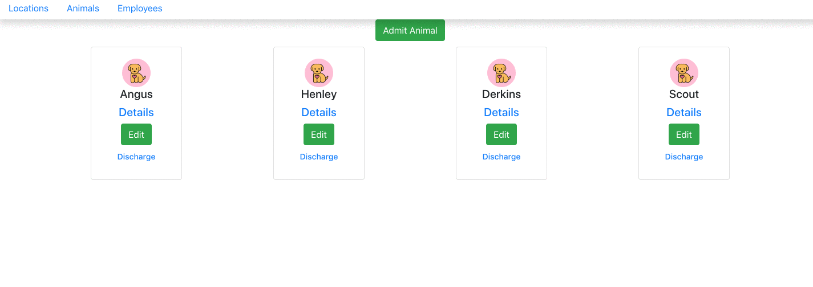

# Edit an Animal

In this chapter, you are going to learn how to edit an animal's information. We will use a form very similar to the form we used to add an animal except, this time the form will be pre-filled with the current information of the animal we want to edit.

**_Quick Note_:** All of the code you will see from here to the end of this chapter needs to be in place before this feature will work.


## Create the AnimalEditForm Component

This component component will populate the input fields with the current values from the API. We will obtained the animal details via a fetch call in `componentDidMount`.

Here is the flow of the AnimalEditForm component:
1. Component loads - Save button should be disabled since the data is not available yet..
2. `componentDidMount()` calls API to get the animal based on the animalId in the URL.
3. Data loads and `setState()` is invoked with new data (also set loadingStatus to false)
4. `render()` is invoked, displaying animal details and ready for edits.
5. Make changes and select `save`
6. In state, set `loadingStatus` to true - this ensures the user cannot repeatedly click button while API is being udated.
7. Invoke `AnimalManger.put` to change the API data.
8. Once the API has updated, change the view to display all the animals.


> components/animal/AnimalEditForm.js

```jsx
import React, { Component } from "react"
import AnimalManager from "../../modules/AnimalManager"
import "./AnimalForm.css"

export default class AnimalEditForm extends Component {
    //set the intial state
    state = {
      animalName: "",
      breed: "",
      loadingStatus: true,
    };

    handleFieldChange = evt => {
      const stateToChange = {}
      stateToChange[evt.target.id] = evt.target.value
      this.setState(stateToChange)
    }

    updateExistingAnimal = evt => {
      evt.preventDefault()
      this.setState({ loadingStatus: true });
      const editedAnimal = {
        id: this.props.match.params.animalId,
        name: this.state.animalName,
        breed: this.state.breed
      };

      AnimalManager.update(editedAnimal)
      .then(() => this.props.history.push("/animals"))
    }

    componentDidMount() {
      AnimalManager.get(this.props.match.params.animalId)
      .then(animal => {
          this.setState({
            animalName: animal.name,
            breed: animal.breed,
            loadingStatus: false,
          });
      });
    }

    render() {
      return (
        <>
        <form>
          <fieldset>
            <div className="formgrid">
              <input
                type="text"
                required
                className="form-control"
                onChange={this.handleFieldChange}
                id="animalName"
                value={this.state.animalName}
              />
              <label htmlFor="animalName">Animal name</label>

              <input
                type="text"
                required
                className="form-control"
                onChange={this.handleFieldChange}
                id="breed"
                value={this.state.breed}
              />
              <label htmlFor="breed">Breed</label>
            </div>
            <div className="alignRight">
              <button
                type="button" disabled={this.state.loadingStatus}
                onClick={this.updateExistingAnimal}
                className="btn btn-primary"
              >Submit</button>
            </div>
          </fieldset>
        </form>
        </>
      );
    }
}
```

## Route for Showing Animal Edit Form

Next, define a new route in **`<ApplicationViews>`** for editing a single animal. Be sure to import the **`<AnimalEditForm>`** component.

```jsx
<Route
  path="/animals/:animalId(\d+)/edit" render={props => {
    return <AnimalEditForm {...props} />
  }}
/>
```

You will also need to add `exact` to the route for `AnimalDetail`

```jsx
<Route exact path="/animals/:animalId(\d+)" render={(props) => {
    // Pass the animalId to the AnimalDetailComponent
    return <AnimalDetail animalId={parseInt(props.match.params.animalId)} {...props}/>
}} />
```

At this point you should be able to see the edit animal form with a URL like this: `http://localhost:3000/animals/2/edit`

**(It won't fully work yet.)**


## Add Edit Button to the AnimalCard

In the **`<AnimalCard>`** component, you will add a new button: `Edit`. When the user clicks the button, the route should change to `/animals/:animalId/edit`.


```jsx
<button type="button"
        onClick={() => {this.props.history.push(`/animals/${this.props.animal.id}/edit`)}}>Edit</button>

```


At this point, view an AnimalDetail. You should see the `Edit` button. Test it out.

Oh no, **Error**. `TypeError: Cannot read property 'push' of undefined`. What is that? The router props need to be passed through the **`<AnimalList>`** to the **`<AnimalCard>`**  component. We can do that with `{...props}`. The spread operator copies own enumerable properties from a provided object onto a new object.


> components/animal/AnimalList.js
Add `{...this.props}` to the AnimalCard.

```jsx
<AnimalCard
  key={animal.id}
  animal={animal}
  deleteAnimal={this.deleteAnimal}
  {...this.props}
/>
```

Test again. You should be able to navigate to the animal edit view.


## Update method in AnimalManager
> modules/AnimalManager.js

Finally, define a method in your `AnimalManager` for the update fetch call. You will use PUT in the HTTP request. This method will take an the updated animal as an object and save to the database.

```jsx
update(editedAnimal) {
    return fetch(`${remoteURL}/animals/${editedAnimal.id}`, {
      method: "PUT",
      headers: {
        "Content-Type": "application/json"
      },
      body: JSON.stringify(editedAnimal)
    }).then(data => data.json());
  }
```




## Practice: Edit Employees, Locations, and Owners.

1. Add a button to each employee, location, and owner card to `Edit`.
2. Create new components for editing employees, locations, and owners.
3. In the edit form components, fetch the data of the employee, location, or owner within `componentDidMount` and pre-fill the forms.
3. Add the appropriate routes to `ApplicationViews` to render the edit form when the user clicks the edit button.
4. Update **`<EmployeeManager>`**, **`<LocationManager>`** and **`<OwnerManager>`** with an `update` method to modify existing objects in the API.


