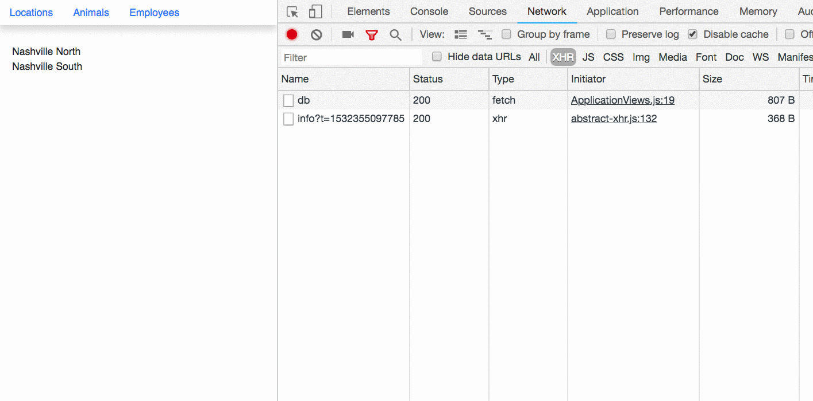

# Populating React Component State from an API

Up to this point, you have used state data that you hard-coded into your application. Now it's time to implement a more realistic way in which you would retrieve your data. You will request it from your JSON API database.

First empty out your current hard-coded state in the **`ApplicationViews`** component. Reconfigure it to the following structure. You're going to query the entire API and populate this data structure.

```js
state = {
    data: {
        locations: [],
        animals: [],
        employees: []
    }
}
```

## Populate the API

You are going to use `json-server` to create an API for your kennel application.

In the root directory of your project, create an `api` directory that is a sibling to `src`. Create a file in that directory named `kennel.json`.

```sh
mkdir api
touch api/kennel.json
```

Add your data to the JSON file.

```json
{
    "employees": [
        { "id": 1, "name": "Jessica Younker" },
        { "id": 2, "name": "Jordan Nelson" },
        { "id": 3, "name": "Zoe LeBlanc" },
        { "id": 4, "name": "Blaise Roberts" }
    ],
    etc...
}
```

Open a new terminal window, and start your API with the following command.

```sh
json-server -p 5002 -w kennel.json
```

## Querying the Data from your API

In React, retrieving state from a remote API works in, what seems like, a counterintuitive way. React must first render the component to the DOM without any data, then you will request the data and re-render the component.

One of the lifecycle methods available to every React component is [componentDidMount](https://reactjs.org/docs/react-component.html#the-component-lifecycle). Straight from their docs (emphasis mine):

> `componentDidMount()` is invoked immediately after a component is mounted. Initialization that requires DOM nodes should go here. _If you need to load data from a remote endpoint, this is a good place to instantiate the network request._

The `componentDidMount()` hook runs after the component output has been rendered to the DOM, so if your component needs API data, that is the place to do it. Here is how you would write it to retrieve employee data from an API being served by [json-server](https://github.com/typicode/json-server) on port 5002.

```js
componentDidMount() {
    const newState = {}

    fetch("http://localhost:5002/animals")
        .then(r => r.json())
        .then(animals => newState.animals = animals)
        .then(() => fetch("http://localhost:5002/employees")
        .then(r => r.json()))
        .then(employees => newState.employees = employees)
        .then(() => fetch("http://localhost:5002/locations")
        .then(r => r.json()))
        .then(locations => newState.locations = locations)
        .then(() => this.setState(newState))
}
```

## Component LifeCycle


That code above used the `fetch` API in JavaScript to query your API, then serialize the response as a JSON object, then take the JSON object and set the state of your component.

Here's what the final component looks like.

> components/ApplicationViews.js

```js
import { Route } from 'react-router-dom'
import React, { Component } from "react"
import AnimalList from './animal/AnimalList'
import LocationList from './location/LocationList'
import EmployeeList from './employee/EmployeeList'


export default class ApplicationViews extends Component {
    state = {
        locations: [],
        animals: [],
        employees: [],
        owners: []
    }

    componentDidMount() {
        const newState = {}

        fetch("http://localhost:5002/animals")
            .then(r => r.json())
            .then(animals => newState.animals = animals)
            .then(() => fetch("http://localhost:5002/employees")
            .then(r => r.json()))
            .then(employees => newState.employees = employees)
            .then(() => this.setState(newState))
    }


    render() {
        return (
            <React.Fragment>
                <Route exact path="/" render={(props) => {
                    return <LocationList locations={this.state.locations} />
                }} />
                <Route exact path="/animals" render={(props) => {
                    return <AnimalList animals={this.state.animals} />
                }} />
                <Route exact path="/employees" render={(props) => {
                    return <EmployeeList employees={this.state.employees} />
                }} />
            </React.Fragment>
        )
    }
}
```

## Export Default Combined with Definition

You should also note that in this component, the **`ApplicationViews`** component is being exported as soon as it is defined. This is a perfectly acceptable way to do an export in React, especially when there is only one component to export.

```js
export default class ApplicationViews extends Component {
```

From this point on in the tutorial, you will see components being exported immediately, instead of after the definition.

## Resources

* [React App Requests to JSON API](https://www.youtube.com/watch?v=vwWPM7za3Pk&list=PLhScwEnhQ-bmroyHFduwgOZ1KrdDvk_44) video series
* [React for Everyone](https://www.youtube.com/playlist?list=PLLnpHn493BHFfs3Uj5tvx17mXk4B4ws4p) video series

## Practice

1. Refactor your code to populate the locations and the owners from your API.
1. Once you have everything rendering, remove the empty arrays you defined in the `state` object so you can see how the React lifecycle works. What happened when you removed them?

```js
// Change your state definition to this. Observe what happens.
state = {

}
```

> **Pro tip:** Remember to use your network tab in the Chrome Developer Tools to watch your network requests and preview the responses.



## Advanced Challenge: Search your Data

> Remember that challenges, especially advanced ones, are completely optional and should not be attempted until you have completed the practice exercises and understand the concepts used in them.

Not for the weak of heart, is this challenge. Put an input box in your navigation bar. When your customer types in any characters, then you must find any objects in the animals, locations, or employees collections that have a name which contains that string.

When the customer presses the ENTER key, all three collections in your API need to be queried to find any item that matches, and then a new component should be shown whose job it is to show the items that were found, if any.


