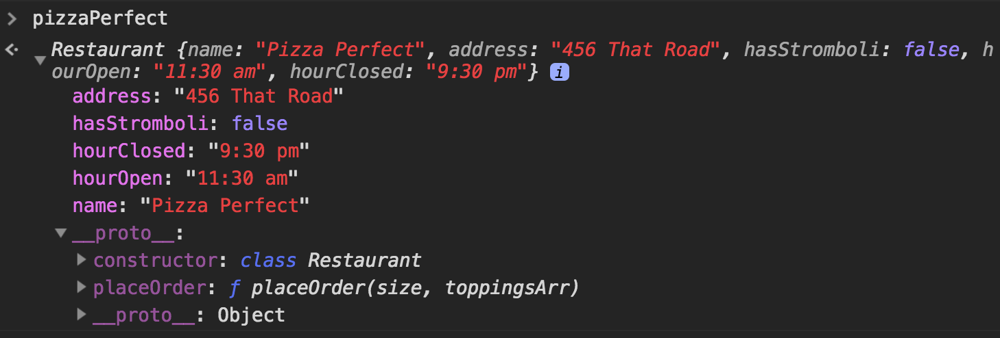

Often we need to represent an idea or concept in our programs — an employee, or a car, or a concert or restaurant. Representing these concepts directly in code comes in two parts: data to represent the state, and functions to represent the behavior. ES6 classes give us a convenient syntax for defining the state and behavior of objects that will represent our concepts.

So far you've represented concepts like these as key-value pairs in simple JavaScript objects.

```js
const restaurant = {
  name: "Nicky's Pizza",
  address: "123 Sesame St",
  hasStromboli: true,
  hourOpen: "11:00 am",
  hourClosed: "10:00 pm",
  placeOrder: (size, toppingsArr) => {
    console.log(`You ordered a ${size} pizza covered in ${toppingsArr.join(", ")})
  }
}
```

Let's look at how you would create this object using the `class` keyword.

```js
class Restaurant {

  constructor() {
    this.name = "Nicky's Pizza"
    this.address = "123 Sesame St"
    this.hasStromboli = true
    this.hourOpen = "11:00 am"
    this.hourClosed = "10:00 pm"
  }

  placeOrder(size, toppingsArr) {
    console.log(`You ordered a ${size} pizza covered in ${toppingsArr.join(", ")})
  }
}
```

This allows us to create an object with `const pizzaJoint = new Restaurant()`. Of course, this is fairly limiting as it is. We can only make an object, or an instance of Restaurant, the same way every time.

What if we wanted to make a lot of different piza joints that shared similar properties, but each had its own values for those properties?

Here's a refactor, with the ability to pass in those unique values to each new retaurant we create:

```js
class Restaurant {

  constructor(name, address, hasStromboli, hourOpen, hourClosed) {
    this.name = name
    this.address = address
    this.hasStromboli = hasStromboli
    this.hourOpen = hourOpen
    this.hourClosed = hourClosed
  }

  placeOrder(size, toppingsArr) {
    console.log(`You ordered a ${size} pizza covered in ${toppingsArr.join(", ")}. Please pick up before ${this.hourClosed}!`)
  }

}
```

Now you can make many instances of `Restaurant`, and each one will be unique but based on a common definition of how a restaurant will be represented in our project

```js
const pizzaPerfect = new Restaurant("Pizza Perfect", "456 That Road", false, "11:30 am", "9:30 pm")
const pizzaChain = new Restaurant("Pizza Hut", "8907 This Road", false, "10:30 am", "11:00 pm")
const italianPlace = new Restaurant("Geno's Joint", "4567 Other Road, Suite #45", true, "11:30 am", "8:30 pm")
```

Logging out a Restaurant instance will show that it's an object, complete with inheritance from the `Restaurant` and `Object` objects:



A few things to note.
* Classes can only contain method definitions, not data properties;
* When defining methods, you use shorthand method definitions;
* Unlike when creating objects, you do not separate method definitions in class bodies with commas

## Practice: Big Scary Birds

> The learning objective for this practice exercise is to use the class syntax to establish a reusable definition of how an object will be defined in a program

Your job is to create a large, flightless bird class that defines the properties of a feathered terror. It should have the following properties:

* height
* flightless (should always be true)
* isExtinct
* name
* running speed
* toString -- This will be a method that outputs a description of the bird based on some of its properties. Example output: "The Cassowary is a big, scary bird that stands up to 6 ft and can run up to 30 mph!"

Create at least 3 instances of the class.
